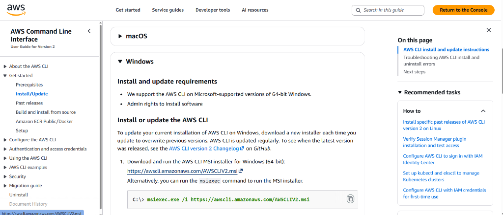
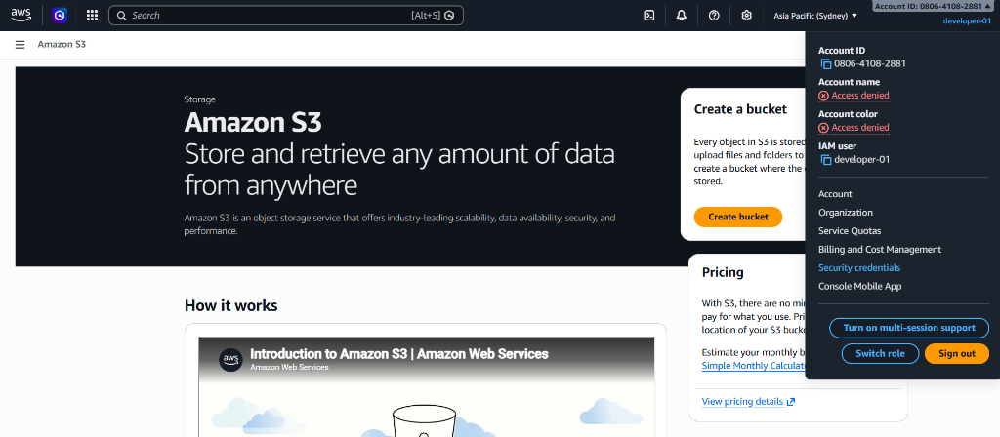
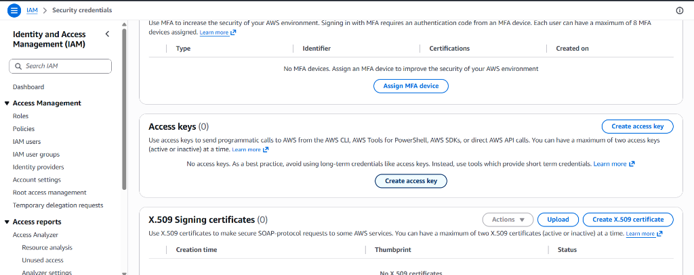
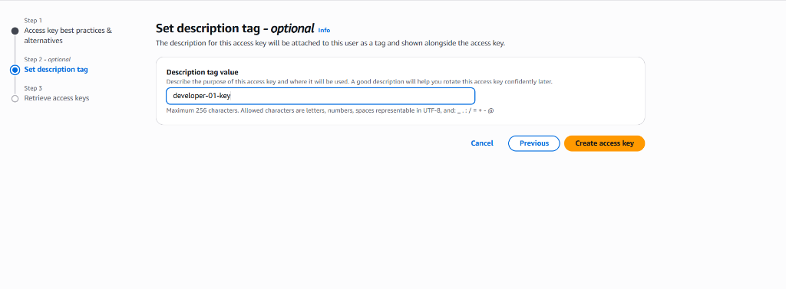

# Hướng Dẫn Thực Hành: AWS CLI và Cấu Hình Xác Thực

Tài liệu này hướng dẫn các bước cài đặt AWS CLI, phát hành mã khóa xác thực, cấu hình trên môi trường local và thiết lập cơ chế xác thực đa yếu tố (MFA).

---

## 1. Cài đặt AWS CLI phiên bản mới nhất (Latest)

1. Tải và cài đặt AWS CLI mới nhất trên Windows theo hướng dẫn tại [AWS CLI Install Guide](https://docs.aws.amazon.com/cli/latest/userguide/getting-started-install.html).

   Hoặc chạy lệnh cài đặt trực tiếp qua bộ cài MSI từ PowerShell (Run as Administrator):
   ```powershell
   msiexec.exe /i https://awscli.amazonaws.com/AWSCLIV2.msi
   ```
   
   

2. Đóng và mở lại Terminal để cập nhật biến môi trường, sau đó kiểm tra phiên bản sau khi cài đặt thành công:
   ```powershell
   aws --version
   ```
   *Kết quả mong đợi dạng:* `aws-cli/2.x.x Python/3.x.x Windows/10 ...`

---

## 2. Phát hành Access/Private Key cho User đã tạo

*Lưu ý: Có thể dùng tài khoản Admin để phát hành cho User đó hoặc chính User đó tự truy cập để phát hành.*

> [!CAUTION]
> **LƯU Ý QUAN TRỌNG VỀ BẢO MẬT:**
> Tuyệt đối không được lộ (không được lộ) Access Key và Secret Access Key (không commit lên GitHub/GitLab, không lưu ở định dạng văn bản thô công khai). Kẻ xấu có thể quét được và lạm dụng tài khoản để trục lợi hoặc phá hoại tài nguyên, gây thiệt hại lớn về chi phí.

Các bước thực hiện trên AWS Console:

1. Đăng nhập vào AWS Console > Vào menu tài khoản ở góc trên bên phải > Chọn **Security credentials**.

   

2. Cuộn xuống mục **Access keys** > Chọn **Create access key**.

   

3. Chọn mục đích sử dụng là **CLI (Command Line Interface)** và xác nhận đồng ý với các khuyến nghị bảo mật.

4. Nhập thẻ mô tả (Description tag) cho khóa của bạn (ví dụ: `developer-01-key`).

   

5. Nhấn tạo khóa và chọn **Download .csv file** để lưu thông tin khóa về máy tính cá nhân.

---

## 3. Thiết lập Access/Secret Key cho CLI và Kiểm Tra

1. Mở cửa sổ dòng lệnh (PowerShell hoặc Terminal) và chạy lệnh:
   ```powershell
   aws configure
   ```
2. Nhập các thông tin tương ứng từ file `.csv` khi được yêu cầu:
   - **AWS Access Key ID [None]:** `Nhập_Access_Key_ID_từ_file_CSV`
   - **AWS Secret Access Key [None]:** `Nhập_Secret_Access_Key_từ_file_CSV`
   - **Default region name [None]:** `ap-southeast-1` (hoặc Singapore/Sydney region tùy dự án)
   - **Default output format [None]:** `json`

3. Sử dụng các câu lệnh sau để kiểm tra cấu hình và thao tác cơ bản với S3:

   - **Kiểm tra thông tin tài khoản cấu hình (Test credential):**
     ```powershell
     aws sts get-caller-identity
     ```
     *Kết quả mong đợi dạng JSON:*
     ```json
     {
         "UserId": "AIDAXXXXXXXXXXXXXXXXX",
         "Account": "080641082881",
         "Arn": "arn:aws:iam::080641082881:user/developer-01"
     }
     ```

   - **Liệt kê danh sách các S3 Bucket (List all S3 buckets):**
     ```powershell
     aws s3 ls
     ```

   - **Liệt kê tệp tin/thư mục trong đường dẫn cụ thể (List files in S3 path):**
     ```powershell
     aws s3 ls s3://path
     ```

   - **Tải tệp tin từ S3 về máy local (Download file):**
     ```powershell
     aws s3 cp s3://path/to/file.txt D:/local/destination/file.txt
     ```

   - **Tải tệp tin từ máy local lên S3 (Upload file):**
     ```powershell
     aws s3 cp D:/local/destination/file.txt s3://path/to/file.txt
     ```
