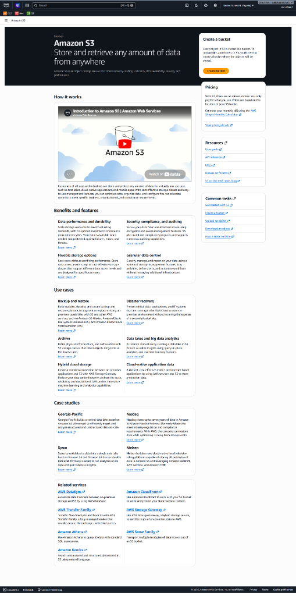
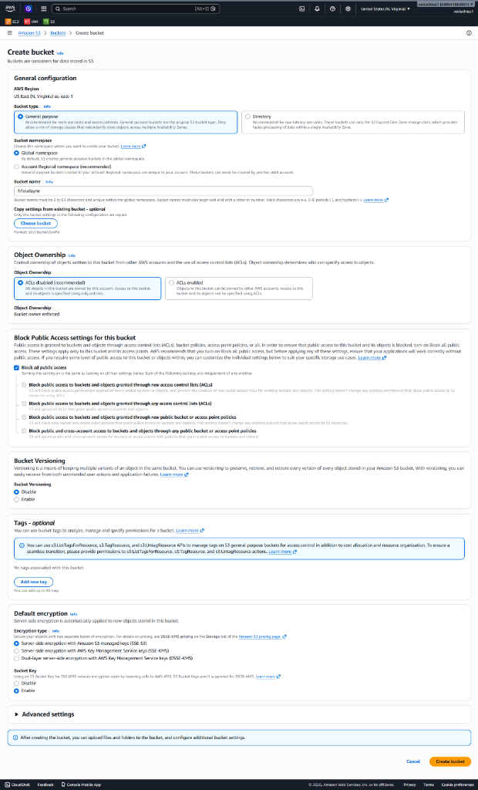
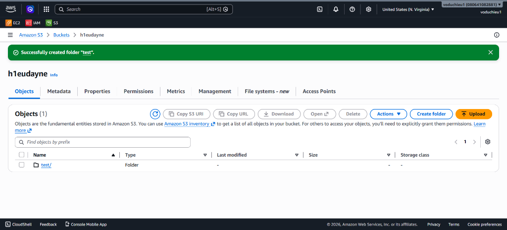
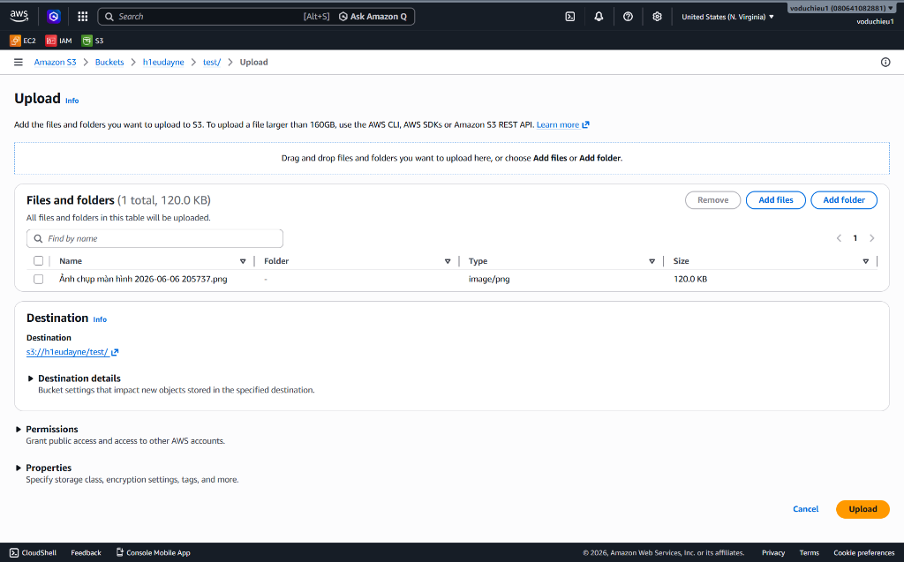
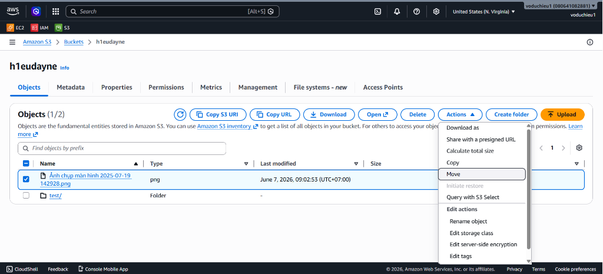

# Amazon S3 Hands-on Lab (Basic Operations)

Bài thực hành này hướng dẫn bạn các thao tác cơ bản nhất khi làm việc với giao diện điều khiển (AWS Console) của Amazon S3 bao gồm: truy cập dịch vụ, khởi tạo Bucket, tạo Folder, upload file/folder và di chuyển (move) đối tượng giữa các thư mục.

---

## Các bước thực hiện chi tiết

### Bước 1: Truy cập dịch vụ Amazon S3
* Đăng nhập vào AWS Management Console.
* Trên thanh tìm kiếm ở trên cùng, gõ **S3** và chọn dịch vụ **S3 (Simple Storage Service)**.
* Giao diện tổng quan của Amazon S3 sẽ hiển thị như dưới đây:

---

### Bước 2: Khởi tạo một S3 Bucket
* Nhấp vào nút **Create bucket** màu cam.
* Cấu hình các thông số cơ bản cho Bucket:
  * **AWS Region**: Chọn khu vực vật lý mong muốn (ví dụ: `US East (N. Virginia) us-east-1` hoặc `ap-southeast-1`).
  * **Bucket name**: Nhập tên cho Bucket của bạn (ví dụ: `h1eudayne`). 
    * *Lưu ý*: Tên Bucket phải là duy nhất trên toàn cầu (Globally Unique) và tuân thủ các quy tắc đặt tên của AWS.
  * **Object Ownership**: Chọn **ACLs disabled** (Khuyên dùng để phân quyền tập trung qua Bucket Policy).
  * **Block Public Access settings for this bucket**: Giữ tùy chọn tích **Block all public access** để bảo mật dữ liệu tuyệt đối.
  * **Bucket Versioning**: Giữ **Disable** (hoặc chọn Enable nếu muốn lưu giữ nhiều phiên bản tệp tin).
  * **Default encryption**: Giữ mặc định (mã hóa phía server SSE-S3).
* Cuộn xuống dưới cùng và nhấp vào nút **Create bucket** màu cam để hoàn tất tạo.

---

### Bước 3: Tạo một thư mục (Folder) bên trong Bucket
* Nhấp vào tên Bucket bạn vừa khởi tạo để truy cập vào cấu hình bên trong.
* Trong tab **Objects**, nhấp vào nút **Create folder**.
* Nhập tên thư mục muốn tạo (ví dụ: `test`) và nhấp nút **Create folder** ở dưới cùng.
* AWS Console sẽ hiển thị thông báo tạo thành công và xuất hiện thư mục con dạng `test/` trong danh sách đối tượng:

---

### Bước 4: Tải tệp tin (File) hoặc thư mục lên S3
* Truy cập vào thư mục vừa tạo (ví dụ nhấp vào `test/`).
* Nhấp vào nút **Upload** màu cam ở phía trên bên phải.
* Nhấp vào **Add files** để chọn tệp tin từ máy tính cá nhân của bạn, hoặc **Add folder** để tải lên cả một thư mục.
* Xem lại thông tin đích đến lưu trữ (Destination) ở dưới, sau đó nhấp nút **Upload** màu cam ở góc dưới cùng bên phải để bắt đầu tải lên.

---

### Bước 5: Thực hiện di chuyển tệp tin (Move Object)
* S3 cho phép bạn di chuyển tệp tin từ thư mục gốc (root của bucket) vào trong một thư mục con khác một cách dễ dàng:
  * **Bước 1**: Tại danh sách đối tượng ngoài thư mục gốc của Bucket, tích chọn tệp tin muốn di chuyển (ví dụ: `Ảnh chụp màn hình 2025-07-19 142928.png`).
  * **Bước 2**: Nhấp vào menu **Actions** ở hàng công cụ trên cùng.
  * **Bước 3**: Chọn tính năng **Move** từ danh sách hành động thả xuống.
  * **Bước 4**: Chọn đường dẫn đích (Destination path) trỏ đến thư mục con vừa tạo (ví dụ: `test/`) và xác nhận di chuyển đối tượng.

