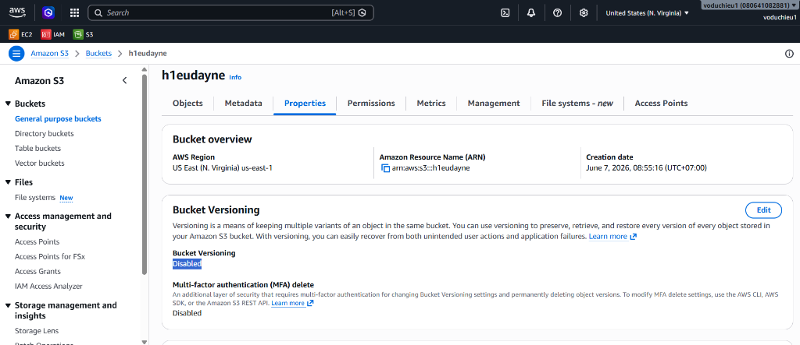
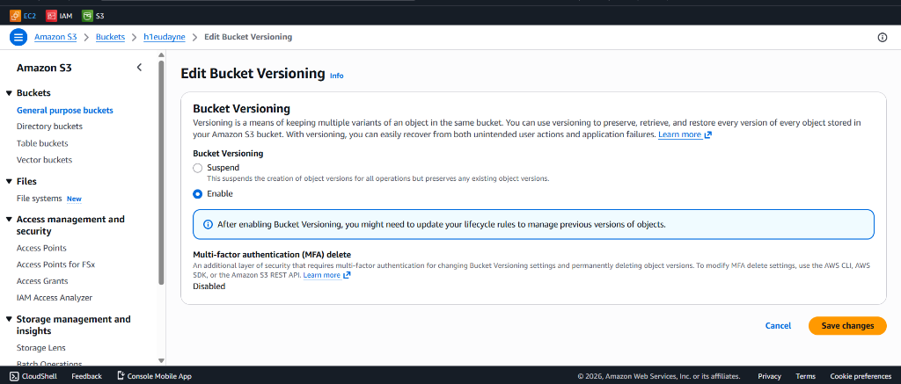
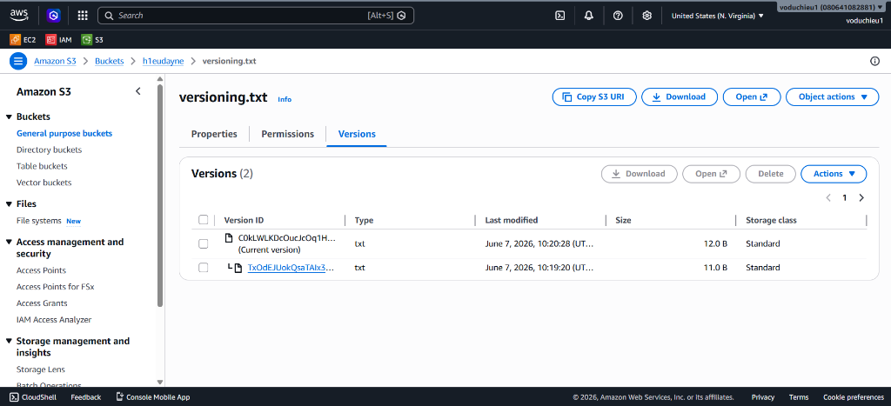
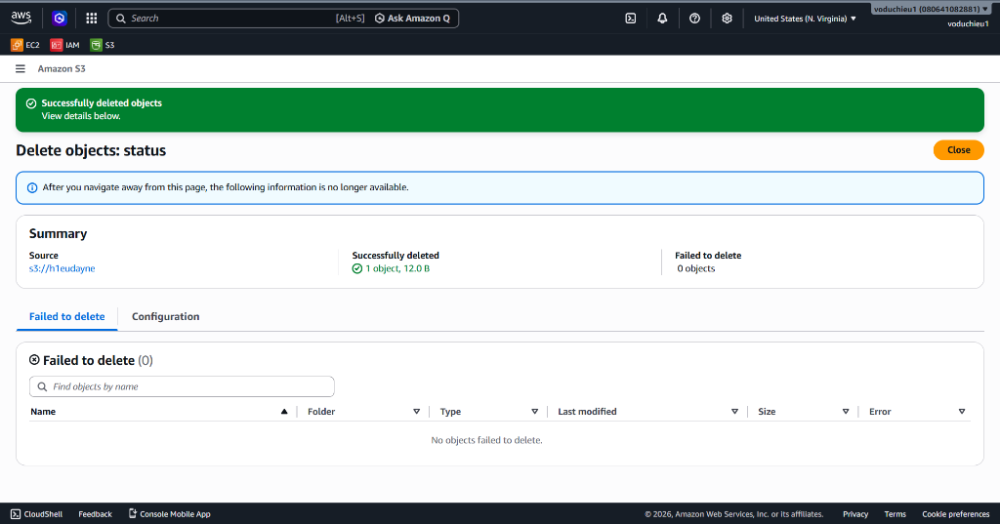
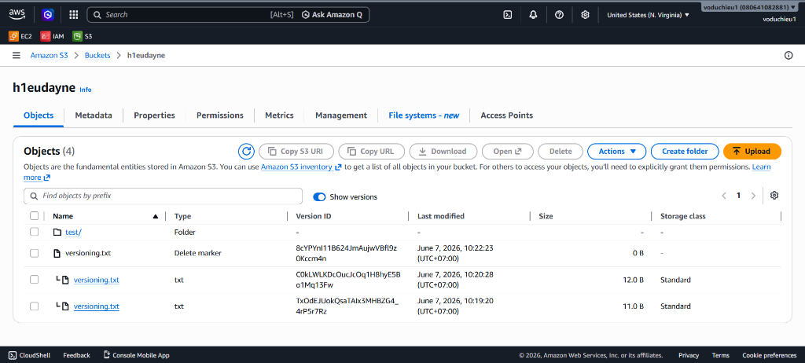

# Amazon S3 Versioning Hands-on Lab

Bài thực hành này hướng dẫn bạn từng bước cách cấu hình tính năng quản lý phiên bản (S3 Versioning) cho một S3 Bucket, kiểm nghiệm cơ chế hoạt động khi ghi đè (tạo version mới) và cơ chế xóa (Delete Marker) để khôi phục dữ liệu khi cần thiết.

---

## Chuẩn bị
* Chuẩn bị sẵn một tệp tin văn bản (ví dụ đặt tên là `versioning.txt`) trên máy tính cá nhân của bạn với nội dung ban đầu đơn giản (ví dụ: `phiên bản 1`).

---

## Các bước thực hiện chi tiết

### Bước 1: Kiểm tra trạng thái Versioning của Bucket
* Truy cập vào AWS Management Console, chọn dịch vụ **S3** và nhấp chọn vào Bucket của bạn (ví dụ: `h1eudayne`).
* Chuyển sang tab **Properties** (Thuộc tính).
* Cuộn xuống mục **Bucket Versioning** và kiểm tra trạng thái hiện tại. Mặc định khi vừa tạo, trạng thái này sẽ là **Disabled** (Chưa kích hoạt).

---

### Bước 2: Kích hoạt tính năng S3 S3 Versioning
* Tại mục **Bucket Versioning**, nhấp vào nút **Edit** ở góc phải.
* Chọn tùy chọn **Enable** (Kích hoạt).
* Nhấp vào nút **Save changes** màu cam ở góc dưới cùng bên phải để lưu cấu hình.

---

### Bước 3: Tải tệp tin lên S3 lần đầu tiên
* Chuyển sang tab **Objects** của Bucket.
* Nhấp vào nút **Upload** và tải tệp tin `versioning.txt` đã chuẩn bị ở bước trước lên S3.

---

### Bước 4: Chỉnh sửa và tải lên lại tệp tin để kiểm tra phiên bản mới
* Mở tệp tin `versioning.txt` trên máy tính cá nhân của bạn, chỉnh sửa nội dung bên trong (ví dụ sửa thành: `phiên bản 2`) và lưu lại.
* Thực hiện tải lên (Upload) lại tệp tin `versioning.txt` vừa sửa lên cùng vị trí trong Bucket (ghi đè lên tệp cũ trùng tên).
* Để kiểm tra các phiên bản đang được lưu trữ:
  * Nhấp trực tiếp vào tên tệp tin `versioning.txt` trong danh sách đối tượng của Bucket.
  * Chuyển sang tab **Versions** (Các phiên bản).
  * Bạn sẽ thấy danh sách chứa **2 phiên bản** khác nhau của tệp tin `versioning.txt` cùng tồn tại song song, với các mã **Version ID** độc nhất và mốc thời gian tải lên khác nhau:
    * Phiên bản ở trên cùng có gắn tag **Current version** (phiên bản hiện hành) ứng với nội dung mới nhất.
    * Phiên bản ở dưới là phiên bản cũ đã được lưu trữ an toàn trước khi bị ghi đè.

---

### Bước 5: Thử nghiệm cơ chế xóa khi bật Versioning (Delete Marker)
Khi bật Versioning, hành động xóa đối tượng mặc định không xóa vĩnh viễn dữ liệu mà chỉ đánh dấu xóa:

* **B1 (Thao tác xóa)**: Tại tab **Objects** của Bucket, tích chọn tệp tin `versioning.txt` và nhấp vào nút **Delete** ở thanh công cụ.
* **B2 (Xác nhận xóa)**: Gõ `delete` vào ô xác nhận để xóa tệp tin. Hệ thống sẽ hiển thị thông báo đã xóa đối tượng thành công:

* **B3 (Xác nhận đối tượng biến mất khỏi danh sách mặc định)**: Quay lại tab **Objects** của Bucket. Bạn sẽ thấy tệp tin `versioning.txt` đã biến mất khỏi danh sách hiển thị thông thường (như thể đã bị xóa hoàn toàn).
* **B4 (Bật Show Versions để hiển thị và khôi phục)**:
  * Tại thanh công cụ của tab **Objects**, gạt bật công tắc **Show versions** (Hiển thị các phiên bản) sang chế độ ON.
  * Lúc này, tệp tin `versioning.txt` sẽ xuất hiện trở lại trong danh sách nhưng có sự thay đổi lớn:
    * Dòng trên cùng hiển thị loại đối tượng là **Delete marker** (Đánh dấu xóa) với dung lượng là `0 B` và được coi là phiên bản hiện tại (Current version).
    * Phía dưới là các phiên bản dữ liệu thực tế trước đó của tệp tin vẫn được lưu giữ nguyên vẹn dưới dạng phiên bản cũ.

* **B5 (Mẹo khôi phục)**: Nếu muốn khôi phục lại tệp tin như ban đầu, bạn chỉ cần tích chọn dòng **Delete marker** đó và thực hiện xóa vĩnh viễn chính Delete marker này (hoặc chỉ định xóa Version ID của nó). Sau khi Delete marker biến mất, phiên bản dữ liệu thực tế gần nhất sẽ tự động được đưa lên làm Current version và tệp tin sẽ hiển thị bình thường trở lại.
