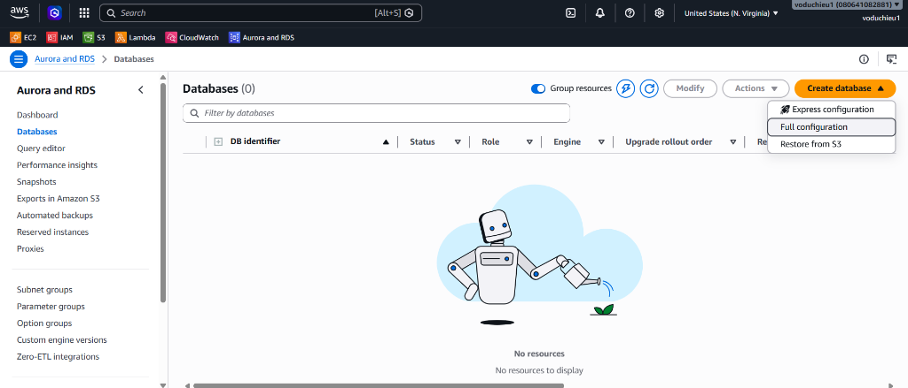
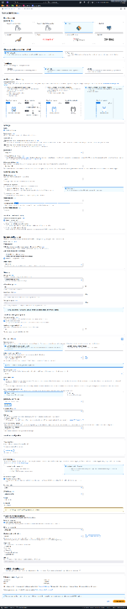
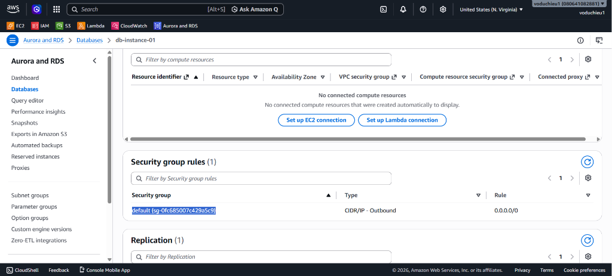
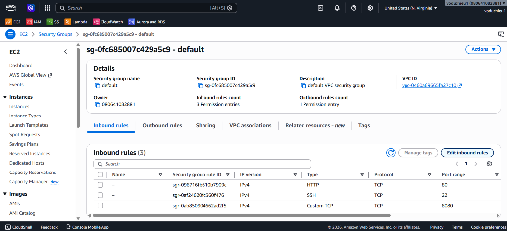
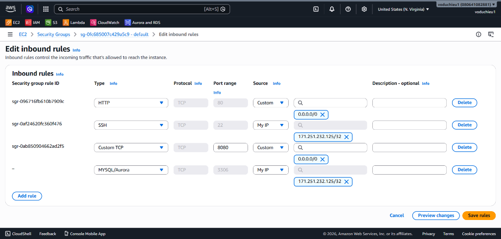
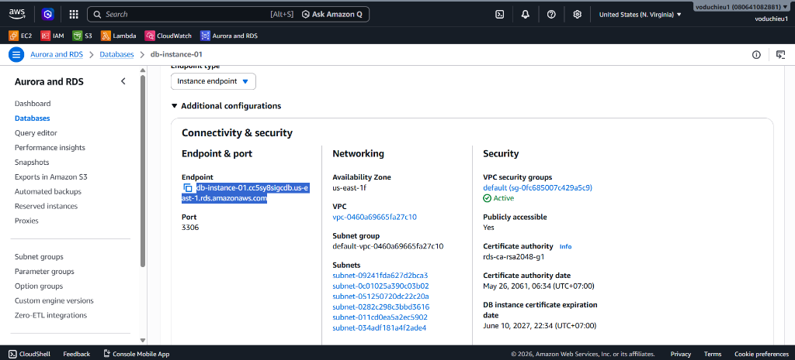
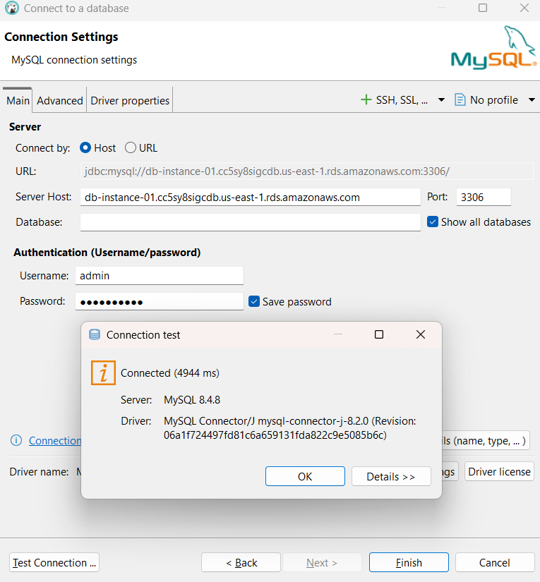

# Amazon RDS Hands-on Lab (Basic RDS Instance Creation)

Bài thực hành này hướng dẫn bạn từng bước khởi tạo một cơ sở dữ liệu quan hệ độc lập (Single RDS Instance) sử dụng dịch vụ **Amazon RDS** trên AWS Console với tùy chọn cấu hình đầy đủ (**Full Configuration**), sử dụng Database Engine **MySQL** và cấu hình phần cứng lớp **db.t3.medium**.

---

## Các bước thực hiện chi tiết

### Bước 1: Truy cập dịch vụ Amazon RDS và chọn phương thức khởi tạo
1. Đăng nhập vào AWS Management Console.
2. Trên thanh tìm kiếm ở trên cùng, gõ **RDS** và chọn dịch vụ **RDS (Relational Database Service)**.
3. Ở menu điều hướng bên trái, chọn **Databases**.
4. Nhấp vào nút **Create database** màu cam ở góc trên bên phải, sau đó chọn tùy chọn **Full configuration** (Cấu hình đầy đủ) từ danh sách thả xuống.

---

### Bước 2: Cấu hình chi tiết RDS Instance
Giao diện khởi tạo cơ sở dữ liệu ở chế độ cấu hình đầy đủ hiện ra, tiến hành cài đặt các thông số như sau:

#### 1. Engine Options (Lựa chọn hệ quản trị)
* **Engine type**: Chọn **MySQL**.
* **Edition**: Giữ nguyên `MySQL Community`.
* **Engine version**: Giữ phiên bản mặc định được khuyến nghị (ví dụ: `8.0.35` hoặc phiên bản mới nhất có sẵn).

#### 2. Templates (Mẫu cấu hình)
* Chọn mẫu **Dev/Test** (Môi trường phát triển và thử nghiệm). Tùy chọn này cho phép bạn cấu hình các loại instance đa dạng bao gồm dòng Burstable (`t` class) như `db.t3.medium` để tối ưu chi phí.

#### 3. Settings (Cấu hình định danh & Tài khoản)
* **DB instance identifier**: Nhập tên định danh cho RDS Instance của bạn (ví dụ: `database-1`).
* **Credentials specification**:
  * **Master username**: Giữ tên mặc định là `admin`.
  * **Master password**: Nhập mật khẩu quản trị và xác nhận mật khẩu (hãy ghi nhớ mật khẩu này để kết nối tới DB sau này).

#### 4. Instance Configuration (Cấu hình phần cứng máy chủ DB)
* **DB instance class**: Chọn **Burstable classes (includes t classes)**.
* Từ danh sách thả xuống, tìm và chọn loại cấu hình **db.t3.medium** (bao gồm 2 vCPUs, 4 GiB RAM, hỗ trợ Network Bandwidth tối đa 0.085 Gbps).

#### 5. Storage (Cấu hình lưu trữ)
* **Storage type**: Chọn **General Purpose SSD (gp3)**.
* **Allocated storage**: Nhập dung lượng lưu trữ tối thiểu mong muốn, ví dụ: **20 GiB**.
* **Storage autoscaling**: Bạn có thể bật tính năng tự động co giãn ổ đĩa nếu dữ liệu lớn dần (giới hạn tối đa có thể cấu hình là 1000 GiB).

#### 6. Connectivity (Cấu hình mạng kết nối)
* **Compute resource**: Chọn **Don't connect to an EC2 compute resource** (Nếu muốn tự cấu hình bảo mật thủ công).
* **VPC**: Chọn Default VPC của bạn.
* **Public access**: Chọn **No** (Đảm bảo an toàn bảo mật, database chỉ được truy cập nội bộ từ các EC2 Instance nằm trong cùng VPC và không công khai ra internet).
* **VPC security group**: Chọn **Create new** để tạo mới một nhóm bảo mật, đặt tên Security Group cho database (ví dụ: `rds-db-sg`).

#### 7. Database Authentication (Phương thức xác thực)
* Chọn **Password authentication** (Sử dụng tài khoản và mật khẩu quản trị để đăng nhập).

#### 8. Additional Configuration (Cấu hình bổ sung)
* Click mở rộng mục này và nhập tên cơ sở dữ liệu mặc định ban đầu tại **Initial database name** (ví dụ: `mydb`).
* Giữ nguyên các cấu hình mặc định khác về Backup (sao lưu tự động), Encryption (mã hóa dữ liệu tĩnh), và Maintenance (bảo trì hệ thống).

* Cuộn xuống góc dưới cùng bên phải của trang và click nút **Create database** màu cam để bắt đầu quá trình khởi tạo instance. Quá trình tạo database thường mất từ 5 đến 10 phút.

---

### Bước 3: Cấu hình mở cổng (Port) kết nối tại Security Group
Mặc dù RDS Instance đã được tạo, để từ môi trường bên ngoài (như máy tính cá nhân hoặc công cụ Database Client) có thể kết nối được tới Database, ta phải cấp quyền truy cập qua cổng mặc định của MySQL là **3306** trong Security Group:

1. Đợi trạng thái DB chuyển sang **Available**. Nhấp vào tên RDS Instance vừa tạo (ví dụ: `db-instance-01`).
2. Tại tab **Connectivity & security**, tìm mục **Security** -> Nhấp vào liên kết của nhóm bảo mật tại phần **VPC security groups** (ví dụ: `default (sg-0fc685007c495c9)`).

3. Trình duyệt chuyển hướng sang bảng điều khiển dịch vụ EC2 tại mục **Security Groups**. Nhấp chọn nhóm bảo mật tương ứng của bạn.
4. Chọn tab **Inbound rules** (Luật đi vào), nhấp chọn nút **Edit inbound rules** ở góc phải.

5. Tại trang cấu hình Inbound Rules, click chọn **Add rule**:
   * **Type**: Chọn **MYSQL/Aurora** (Hệ thống tự động điền Protocol là `TCP` và Port range là `3306`).
   * **Source**: Chọn **My IP** (Hệ thống tự động nhận diện địa chỉ IP ngoại mạng tĩnh máy của bạn, ví dụ: `171.251.232.125/32`) để đảm bảo an toàn bảo mật tối đa. Hoặc chọn **Anywhere-IPv4** (`0.0.0.0/0`) nếu muốn cho phép truy cập từ mọi nơi.
   * Click nút **Save rules** màu cam để lưu cấu hình.

---

### Bước 4: Kết nối tới RDS Instance bằng công cụ Database Client (DBeaver)

#### 1. Lấy thông tin Endpoint kết nối
* Quay lại AWS RDS Console -> chọn Databases -> click vào tên DB Instance của bạn.
* Tại tab **Connectivity & security**, cuộn tới mục **Endpoint & port**.
* Click biểu tượng sao chép để copy nội dung **Endpoint** (địa chỉ máy chủ DB, ví dụ: `db-instance-01.cc5sy8sigcdb.us-east-1.rds.amazonaws.com`).

#### 2. Thiết lập kết nối trên DBeaver
1. Mở ứng dụng **DBeaver** (hoặc bất kỳ Database Client nào của bạn).
2. Tạo kết nối mới (New Database Connection) và chọn **MySQL**.
3. Tại tab **Main**, cấu hình các thông số kết nối:
   * **Connect by**: Chọn `Host`.
   * **Server Host**: Dán địa chỉ Endpoint vừa sao chép từ AWS Console.
   * **Port**: Giữ mặc định `3306`.
   * **Database**: (Để trống hoặc nhập `mydb` nếu bạn có cấu hình Initial database name ban đầu).
   * **Username**: Nhập `admin`.
   * **Password**: Nhập Master Password đã thiết lập ở Bước 2.
4. Click chọn nút **Test Connection...** ở góc dưới cùng bên trái.
5. Cửa sổ **Connection test** hiển thị trạng thái **Connected** thành công kèm thông tin phiên bản MySQL Server và Driver. Click **OK** và chọn **Finish** để hoàn thành kết nối.

