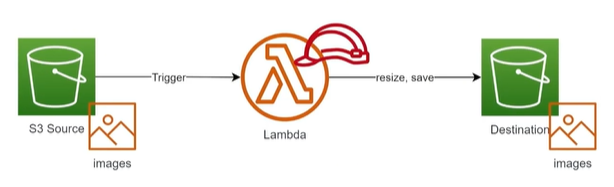

# 2. AWS Lambda Hands-on Lab (Resize ảnh tự động trên Amazon S3) - Đề bài

## I. Sơ đồ hoạt động (Architecture)

  

---

## II. Tổng quan bài Lab (Yêu cầu)

Bài Lab này yêu cầu bạn xây dựng giải pháp tự động hóa co giãn kích thước hình ảnh hướng sự kiện trên đám mây:
1. Khi người dùng tải một tệp tin hình ảnh định dạng `.jpg` hoặc `.png` lên thư mục `images/` của một **Amazon S3 Bucket**.
2. S3 phát hiện sự kiện `ObjectCreated` và tự động gửi Trigger kích hoạt **AWS Lambda Function**.
3. Lambda Function tải hình ảnh xuống từ S3, sử dụng thư viện **Pillow** để xử lý co nhỏ kích thước (Resize) ảnh về nhiều kích cỡ khác nhau (`100px`, `200px`, `500px`, `1000px`) và lưu trữ kết quả tương ứng vào các thư mục khác nhau trên cùng S3 Bucket đó:
   * `resized_100/`
   * `resized_200/`
   * `resized_500/`
   * `resized_1000/`

---

## III. Hướng dẫn chi tiết

Vui lòng xem các bước triển khai chi tiết từng bước tại:
👉 **[Hướng dẫn thực hành chi tiết (README.md)](README.md)**

---

* **Bài trước**: [1. Hello Lambda (Làm quen với AWS Lambda Console)](../1.%20Hello%20Lambda.md)
* **Bài tiếp theo**: [3. AWS Lambda Hands-on Lab(EC2 Auto Start-Stop) (Lab bật tắt EC2 tự động)](../3.%20AWS%20Lambda%20Hands-on%20Lab%28EC2%20Auto%20Start-Stop%29/3.%20AWS%20Lambda%20Hands-on%20Lab%28EC2%20Auto%20Start-Stop%29.md)
