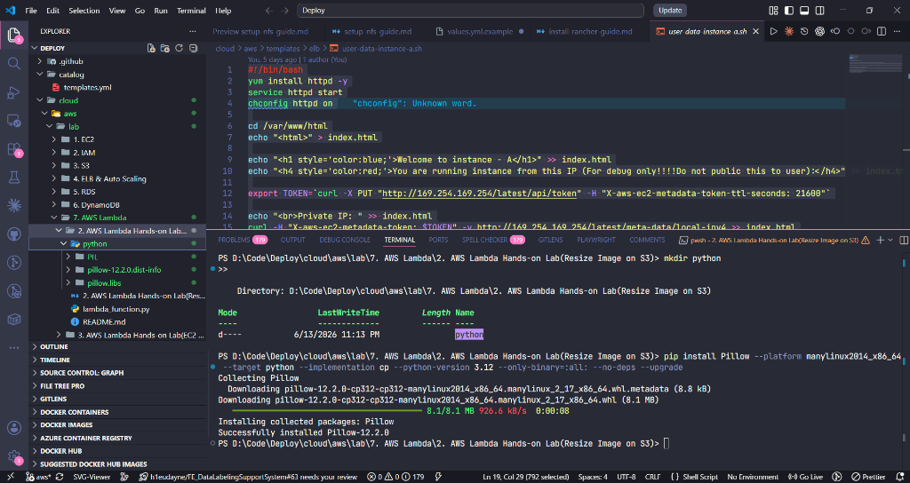
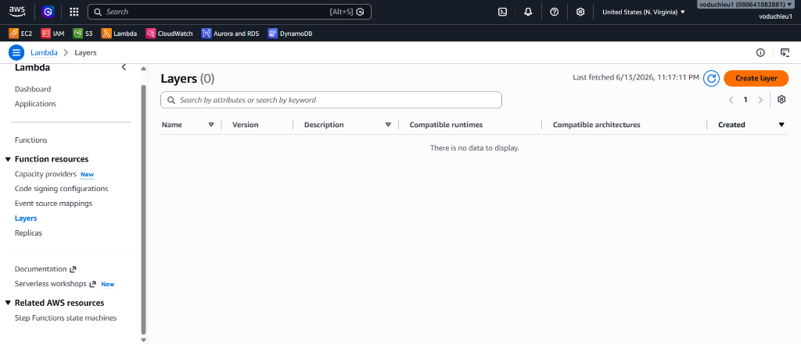
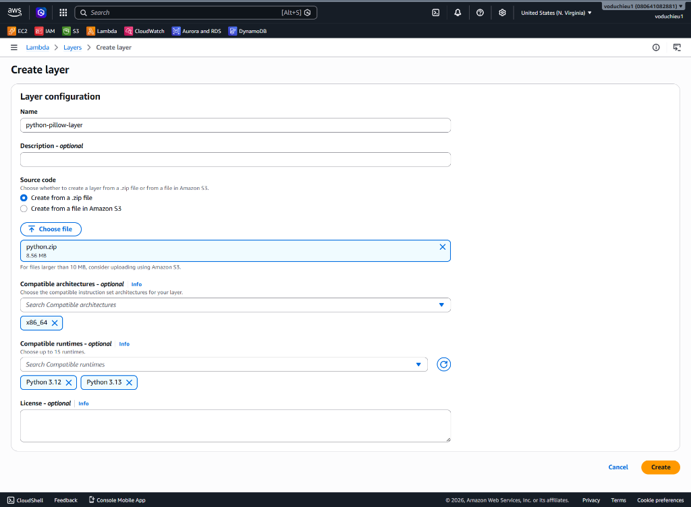
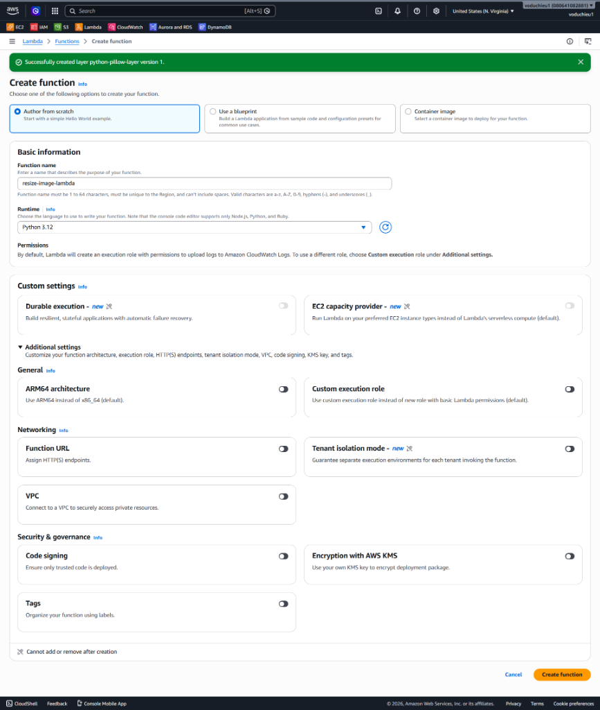

# 2. AWS Lambda Hands-on Lab (Resize ảnh tự động trên Amazon S3) - Hướng dẫn chi tiết

👉 **[Xem Đề bài / Yêu cầu bài Lab](2.%20AWS%20Lambda%20Hands-on%20Lab%28Resize%20Image%20on%20S3%29.md)**

---

## Các bước thực hiện chi tiết

### Bước 1: Tạo S3 Bucket và Thư mục chứa ảnh

1. Truy cập **Amazon S3 Console**.
2. Nhấp chọn **Create bucket**, tạo một bucket mới với tên bất kỳ (ví dụ: `h1eudayne-images-bucket`).
3. Truy cập vào bucket vừa tạo, chọn **Create folder** và tạo một thư mục tên là `images` để chứa các tệp tin hình ảnh tải lên.

---

### Bước 2: Tạo Lambda Layer (Sử dụng Git Bash / Powershell)

Vì môi trường Python của AWS Lambda không tích hợp sẵn thư viện xử lý ảnh **Pillow (PIL)**, chúng ta cần tạo một Lambda Layer chứa thư viện này để nhúng vào hàm.

> [!IMPORTANT]
> Thư viện **Pillow** phải được tải xuống và biên dịch tương thích với hệ điều hành **Amazon Linux 2** (Runtime của Lambda trên cloud) thay vì môi trường local như Windows hay macOS.

1. Mở **Git Bash** hoặc **PowerShell** tại thư mục dự án của bạn.
2. Tạo thư mục tên là `python` để lưu trữ thư viện:
   ```bash
   mkdir python
   ```
3. Chạy lệnh cài đặt Pillow chỉ định nền tảng (platform) và runtime Python tương thích (ví dụ: Python 3.12):

   * **Trên Git Bash / Linux (Lệnh 1 dòng):**
     ```bash
     pip install Pillow --platform manylinux2014_x86_64 --target python --implementation cp --python-version 3.12 --only-binary=:all: --no-deps --upgrade
     ```
   * **Trên PowerShell (Lệnh nhiều dòng):**
     ```powershell
     pip install Pillow `
         --platform manylinux2014_x86_64 `
         --target python `
         --implementation cp `
         --python-version 3.12 `
         --only-binary=:all: `
         --no-deps `
         --upgrade
     ```

<p align="center">
  
</p>

---

### Bước 3: Nén zip thư mục python vừa tạo

1. Sau khi cài đặt xong, bạn sẽ thấy thư mục `python` chứa các thư mục con `PIL`, `pillow_libs`, và metadata.
2. Thực hiện nén thư mục `python` này thành tệp tin `python.zip` (dung lượng sau khi nén khoảng 8.5 MB).

---

### Bước 4: Tải lên Layer lên Lambda

1. Truy cập **AWS Lambda Console** $\rightarrow$ Chọn mục **Layers** ở danh sách menu bên trái.

<p align="center">
  
</p>

2. Nhấp nút **Create layer** ở phía bên phải màn hình.
3. Cấu hình thông tin Layer:
   * **Name**: `python-pillow-layer`.
   * **Upload**: Tải lên tệp tin `python.zip` đã chuẩn bị ở Bước 3.
   * **Compatible architectures**: Chọn `x86_64`.
   * **Compatible runtimes**: Chọn `Python 3.12` (và có thể chọn thêm `Python 3.13`).
4. Nhấp chọn **Create**.

<p align="center">
  
</p>

---

### Bước 5: Tạo Lambda Function

1. Truy cập **AWS Lambda Console** $\rightarrow$ **Functions** $\rightarrow$ **Create function**.
2. Cấu hình các thông số cơ bản:
   * Chọn **Author from scratch** (Tự viết từ đầu).
   * **Function name**: `resize-image-lambda`.
   * **Runtime**: Chọn **Python 3.12**.
   * **Architecture**: Chọn **x86_64**.
3. Nhấp chọn **Create function**.

<p align="center">
  
</p>

---

### Bước 6: Liên kết Layer và Cấu hình Function

#### 1. Thêm Layer Pillow vào Function
1. Tại giao diện quản lý hàm `resize-image-lambda`, cuộn xuống dưới cùng đến mục **Layers**.
2. Nhấp chọn **Add a layer** $\rightarrow$ Chọn **Custom layers**.
3. Tìm và chọn Layer `python-pillow-layer` với phiên bản vừa tạo ở Bước 4. Nhấn **Add**.

#### 2. Cấu hình quyền truy cập (IAM Role) và tài nguyên (RAM/Timeout)
1. Để Lambda đọc và ghi tệp tin lên S3, hãy đảm bảo Execution Role của hàm có quyền `s3:GetObject` và `s3:PutObject`.
2. Tăng cấu hình tài nguyên: Chuyển sang tab **Configuration** $\rightarrow$ **General configuration** $\rightarrow$ **Edit**:
   * **Memory**: Thiết lập tối thiểu **512 MB** (để Pillow xử lý ảnh mượt mà).
   * **Timeout**: Tăng lên tối thiểu **30 giây** (tránh bị timeout khi xử lý ảnh dung lượng lớn).

#### 3. Cập nhật mã nguồn Lambda
1. Mở file `lambda_function.py` trong tab **Code** và dán đoạn mã nguồn sau (lấy từ [lambda_function.py](lambda_function.py)):
   ```python
   # Xem nội dung đầy đủ ở tệp lambda_function.py cùng thư mục
   ```
2. Nhấn nút **Deploy** để áp dụng thay đổi.

---

### Bước 7: Cấu hình S3 Event Trigger và chạy thử

1. Nhấp chọn **Add trigger** ở phần Function overview của Lambda Console.
2. Chọn **S3** làm Trigger source:
   * **Bucket**: Chọn S3 bucket của bạn.
   * **Event types**: Chọn **All object create events**.
   * **Prefix**: Điền `images/`.
   * Hộp thoại cảnh báo gọi đệ quy: Tích chọn đồng ý (Acknowledge).
3. Nhấp chọn **Add**.
4. **Kiểm nghiệm**:
   * Tải một ảnh `.jpg` bất kỳ lên thư mục `images/` trong S3 Bucket của bạn.
   * Truy cập lại S3 Bucket, kiểm tra các thư mục tự động được tạo: `resized_100/`, `resized_200/`, `resized_500/`, `resized_1000/`.
   * Kiểm tra log thực thi trên **CloudWatch Logs** để xác nhận kết quả xử lý thành công.

---

## Các lỗi thường gặp và Cách khắc phục (Troubleshooting)

### 1. Lỗi: "cannot import name '_imaging' from 'PIL'"
* **Nguyên nhân**: Thư viện Pillow được tải xuống trên Windows/macOS không tương thích với nhân Linux trên Lambda.
* **Cách khắc phục**: Hãy chắc chắn sử dụng đúng lệnh `pip install Pillow` có tham số `--platform manylinux2014_x86_64` ở Bước 2.

### 2. Lỗi: "Task timed out"
* **Nguyên nhân**: Thời gian thực thi mặc định (3 giây) quá ngắn để xử lý tải và nén ảnh.
* **Cách khắc phục**: Hãy tăng cấu hình timeout của Lambda lên 30 - 60 giây trong Configuration.

### 3. Lỗi: "Memory limit exceeded"
* **Nguyên nhân**: Bộ nhớ mặc định (128 MB) không đủ để xử lý ảnh độ phân giải cao.
* **Cách khắc phục**: Tăng cấu hình Memory lên tối thiểu 512 MB trong Configuration.

---

* **Bài trước**: [1. Hello Lambda (Làm quen với AWS Lambda Console)](../1.%20Hello%20Lambda.md)
* **Bài tiếp theo**: [3. AWS Lambda Hands-on Lab(EC2 Auto Start-Stop) (Lab bật tắt EC2 tự động)](../3.%20AWS%20Lambda%20Hands-on%20Lab%28EC2%20Auto%20Start-Stop%29/3.%20AWS%20Lambda%20Hands-on%20Lab%28EC2%20Auto%20Start-Stop%29.md)

---

👉 **[Quay lại Đề bài](2.%20AWS%20Lambda%20Hands-on%20Lab%28Resize%20Image%20on%20S3%29.md)**
