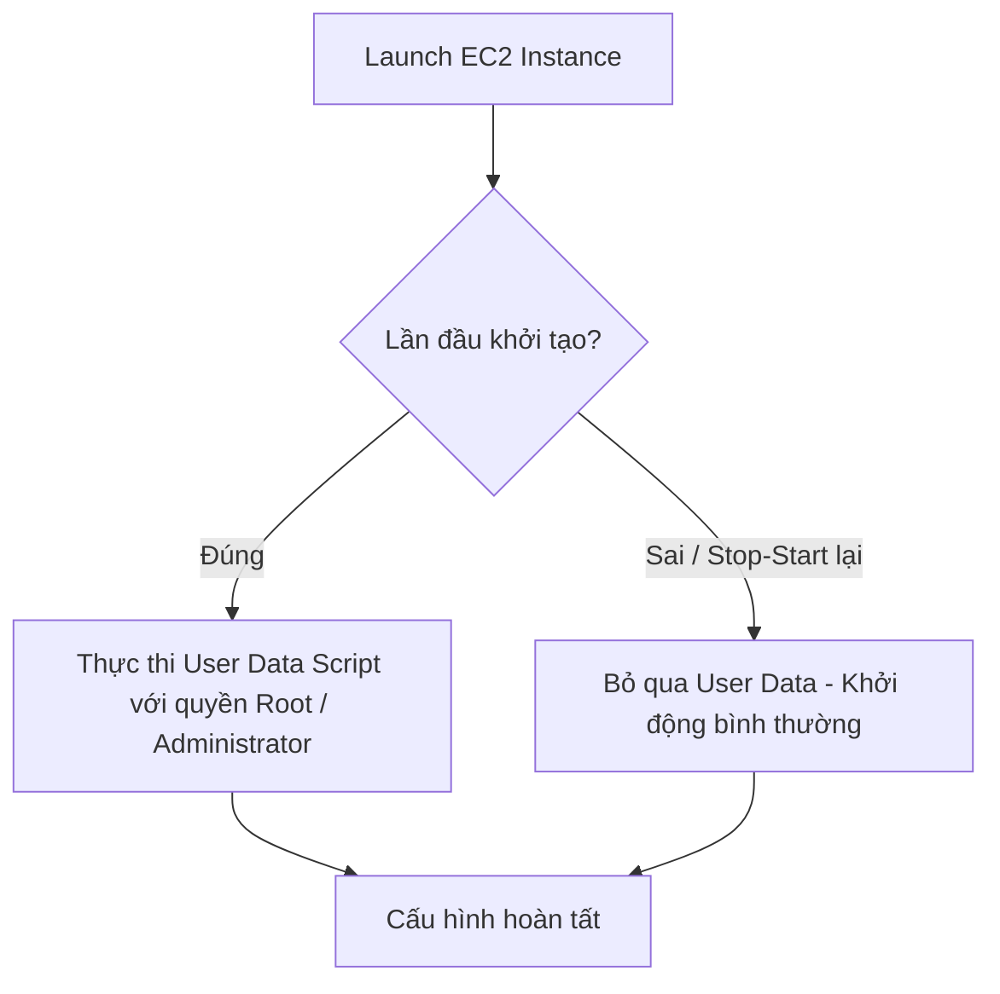
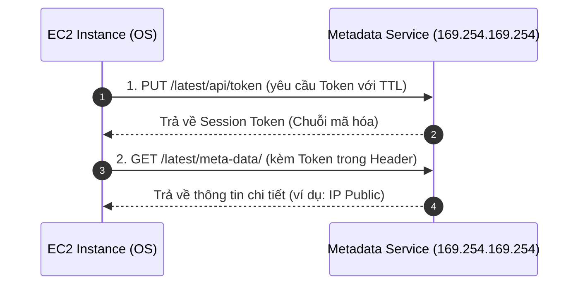

# Amazon EC2 User Data và Instance Metadata

Amazon EC2 cung cấp hai tính năng quan trọng giúp tự động hóa cấu hình khi khởi động máy chủ (User Data) và tự động khám phá, truy xuất các thông tin cấu hình nội bộ của chính máy chủ đó (Instance Metadata).

---

## I. User Data (Dữ liệu người dùng)

**User Data** là cơ chế của EC2 cho phép bạn truyền vào một đoạn mã kịch bản (Script) để tự động chạy tại thời điểm máy chủ ảo được khởi tạo (Launch).



### 1. Các hành động phổ biến sử dụng User Data
*   **Cài đặt phần mềm (Install Software)**: Tự động tải và cài đặt các gói công cụ, runtime hoặc máy chủ web (như Docker, Node.js, Apache, Nginx).
*   **Tải mã nguồn và sản phẩm đóng gói (Download Source Code / Artifacts)**: Tự động kéo mã nguồn mới nhất từ kho Git hoặc tải các gói build (`.zip`, `.jar`) từ Amazon S3 về máy chủ.
*   **Cấu hình tùy biến hệ thống (Customize Settings)**: Thiết lập các biến môi trường, phân quyền thư mục, khởi tạo các tệp cấu hình ứng dụng hoặc khởi động các service.

### 2. Các lưu ý quan trọng về bảo mật và vận hành
*   ⚠️ **LƯU Ý BẢO MẬT CỰC KỲ QUAN TRỌNG**: Tuyệt đối **không lưu trữ các thông tin nhạy cảm** (như mật khẩu Database, tài khoản người dùng, AWS Access Keys/Secret Keys) trực tiếp trong User Data. 
    *   *Lý do*: Bất kỳ người dùng hoặc IAM Role nào có quyền truy cập API `DescribeInstanceAttribute` hoặc giao diện AWS Console đều có thể đọc được toàn bộ nội dung User Data dưới dạng văn bản thường (Plain Text).
    *   *Giải pháp*: Hãy sử dụng các dịch vụ quản lý bảo mật chuyên dụng như **AWS Systems Manager Parameter Store** hoặc **AWS Secrets Manager** để lấy thông tin nhạy cảm một cách an toàn khi khởi động.
*   **Tần suất thực thi**: Mặc định, User Data script chỉ chạy **duy nhất một lần** khi instance được khởi chạy lần đầu tiên. Khi bạn thực hiện hành động dừng và khởi động lại máy chủ (Stop/Start), User Data sẽ không được chạy lại (trừ khi sử dụng cấu hình đặc biệt dạng MIME multi-part).

---

## II. Instance Metadata (Dữ liệu đặc tả Instance)

**Instance Metadata** là bộ thông tin chi tiết về cấu hình và trạng thái của chính EC2 Instance đang chạy. Thông tin này được AWS tự động nạp lên bộ lưu trữ nội bộ của máy chủ sau khi khởi động, cho phép các ứng dụng hoặc script chạy trong máy ảo truy xuất nhanh các thông số hạ tầng mà không cần gọi API AWS từ bên ngoài.

### 1. Địa chỉ truy xuất cố định (Link-Local Address)
Tất cả các truy xuất metadata đều được thực hiện thông qua một địa chỉ IP tĩnh nội bộ cố định (Link-local Address) áp dụng cho cả hệ điều hành **Linux** và **Windows**:
```text
http://169.254.169.254/latest/meta-data/
```
*(Địa chỉ IP này chỉ có thể truy cập được từ chính bên trong máy chủ EC2 đó).*

Các thông tin có thể truy xuất bao gồm:
*   Địa chỉ IP công cộng (Public IP) và IP nội bộ (Private IP).
*   Danh sách Security Groups đang liên kết.
*   ID của bản AMI đã dùng để khởi chạy (`ami-id`).
*   IAM Role đang được gán cho instance (`iam/security-credentials/<role-name>`).
*   Tên máy chủ vật lý, Availability Zone (AZ) đang chạy, loại instance (Instance Type), v.v.

---

## III. Hướng dẫn truy xuất Metadata bằng IMDSv2

AWS hỗ trợ hai phiên bản dịch vụ Metadata là **IMDSv1** (truy xuất trực tiếp bằng HTTP GET) và **IMDSv2** (bảo mật hơn bằng cơ chế xác thực Token). Để đảm bảo an toàn tối đa trước các lỗ hổng bảo mật như SSRF (Server-Side Request Forgery), AWS khuyến nghị sử dụng phiên bản **IMDSv2**.

Truy xuất metadata qua IMDSv2 bao gồm **2 bước bắt buộc**:



### Bước 1: Lấy Session Token
Bạn cần gửi một yêu cầu HTTP PUT tới endpoint tạo token, thiết lập thời gian hết hạn của token bằng header `X-aws-ec2-metadata-token-ttl-seconds` (ví dụ: 21600 giây - 6 tiếng).

*   **Lệnh thực thi trên Linux (curl)**:
    ```bash
    TOKEN=$(curl -X PUT "http://169.254.169.254/latest/api/token" -H "X-aws-ec2-metadata-token-ttl-seconds: 21600")
    ```

### Bước 2: Sử dụng Token để truy xuất thông tin cụ thể
Sau khi đã có chuỗi Token lưu trong biến `$TOKEN`, hãy gửi yêu cầu HTTP GET kèm header xác thực `X-aws-ec2-metadata-token: $TOKEN` tới các đường dẫn con tương ứng.

*   **Truy xuất toàn bộ danh mục metadata sẵn có**:
    ```bash
    curl -H "X-aws-ec2-metadata-token: $TOKEN" http://169.254.169.254/latest/meta-data/
    ```
*   **Lấy địa chỉ IPv4 Public của máy chủ**:
    ```bash
    curl -H "X-aws-ec2-metadata-token: $TOKEN" http://169.254.169.254/latest/meta-data/public-ipv4
    ```
*   **Lấy tên Availability Zone máy chủ đang chạy**:
    ```bash
    curl -H "X-aws-ec2-metadata-token: $TOKEN" http://169.254.169.254/latest/meta-data/placement/availability-zone
    ```
*   **Lấy thông tin tài khoản IAM Role (cung cấp AWS credentials tạm thời)**:
    ```bash
    curl -H "X-aws-ec2-metadata-token: $TOKEN" http://169.254.169.254/latest/meta-data/iam/security-credentials/
    ```
