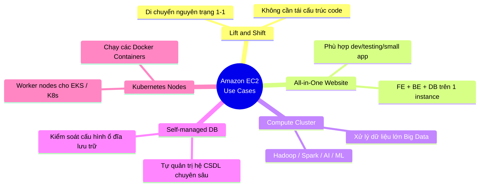

# Các Use Case Của Amazon EC2

**Amazon EC2** là một trong những dịch vụ nền tảng lâu đời và quan trọng nhất của AWS, xuất hiện trong hầu hết mọi sơ đồ kiến trúc hệ thống đám mây. Không chỉ hoạt động độc lập như một máy chủ ảo thông thường, EC2 còn đóng vai trò là "gạch nền" (building block) làm bệ phóng hạ tầng cho các dịch vụ container hóa hiện đại như **AWS ECS (Elastic Container Service)** hay **AWS EKS (Elastic Kubernetes Service)**.

---

## I. Tầm quan trọng của EC2 trong các hệ thống hiện đại

EC2 đóng vai trò cung cấp năng lực tính toán thô (Compute). Hầu hết các dịch vụ cao cấp hơn của AWS thực chất đều chạy ngầm trên nền tảng của các cụm máy ảo EC2 được AWS tự động quản lý và co giãn. Đặc biệt trong kỷ nguyên Container hóa, EC2 được sử dụng làm các **Worker Nodes** để chứa và vận hành các Docker Containers chạy trong cụm EKS (Kubernetes) hoặc ECS.

---

## II. Các Use Case Cơ Bản Của EC2

Dưới đây là 5 trường hợp sử dụng phổ biến và điển hình nhất của Amazon EC2:

### 1. Chiến lược di chuyển "Lift and Shift" (Rehosting)
*   **Mô tả**: Đây là chiến lược dịch chuyển hạ tầng của doanh nghiệp từ môi trường vật lý truyền thống (**On-premise**) lên đám mây AWS một cách nhanh chóng theo tỷ lệ **1-1** mà không có nhu cầu hoặc chưa có thời gian để tái cấu trúc mã nguồn ứng dụng (No Refactoring).
*   **Cách thức**: Máy chủ ảo EC2 được thiết lập hệ điều hành, cấu hình phần cứng (vCPU, RAM, Storage) và kết nối mạng nội bộ y hệt như máy chủ vật lý đang chạy ở trung tâm dữ liệu của doanh nghiệp.
*   **Lợi ích**: Giúp doanh nghiệp nhanh chóng đóng cửa các trung tâm dữ liệu vật lý tốn kém để chuyển lên đám mây mà không gây xáo trộn cho ứng dụng.

### 2. Triển khai Website "All-in-One" (Tất cả trong một)
*   **Mô tả**: Triển khai toàn bộ các thành phần của một ứng dụng web bao gồm giao diện người dùng (**Frontend**), mã xử lý logic (**Backend**), và cơ sở dữ liệu (**Database**) trên cùng một thực thể EC2 duy nhất.
*   **Phù hợp**:
    *   Các dự án nhỏ, landing page doanh nghiệp có lượng truy cập thấp.
    *   Môi trường phát triển và kiểm thử nội bộ (**Development / Staging**).
    *   Giúp tối ưu hóa chi phí tối đa khi mới khởi đầu dự án (chỉ cần trả tiền cho 1 instance nhỏ).

### 3. Cụm máy tính hiệu năng cao (Compute Cluster)
*   **Mô tả**: Kết nối hàng chục, hàng trăm hoặc hàng nghìn máy ảo EC2 để cùng nhau thực hiện các tác vụ tính toán song song cực kỳ phức tạp và đòi hỏi năng lực phần cứng lớn.
*   **Ứng dụng**:
    *   Chạy các cụm xử lý dữ liệu lớn (**Big Data**) sử dụng các framework như **Apache Hadoop**, **Apache Spark**.
    *   Huấn luyện các mô hình Trí tuệ nhân tạo và Học máy (**AI / Machine Learning**).
    *   Xử lý hình ảnh đồ họa 3D quy mô lớn (Rendering) hoặc mô phỏng khoa học, tài chính.

### 4. Tự quản trị cơ sở dữ liệu (Self-managed Database)
*   **Mô tả**: Thay vì sử dụng các dịch vụ Database được AWS quản trị sẵn hoàn toàn (như Amazon RDS, Amazon DynamoDB), doanh nghiệp tự cài đặt và quản lý các hệ quản trị cơ sở dữ liệu (như MySQL, PostgreSQL, Oracle, SQL Server, MongoDB) trực tiếp trên hệ điều hành của EC2.
*   **Lý do lựa chọn**:
    *   Khi cần quyền kiểm soát sâu nhất vào hệ thống tệp tin, bộ nhớ đệm và cấu hình phần cứng của cơ sở dữ liệu.
    *   Cần sử dụng các tính năng hoặc extension đặc biệt mà Amazon RDS không hỗ trợ.
    *   Muốn tận dụng chính sách bản quyền sẵn có của doanh nghiệp (Bring Your Own License - BYOL) để tiết kiệm chi phí.

### 5. Làm Worker Node cho cụm Container (ECS / EKS Worker Nodes)
*   **Mô tả**: EC2 được sử dụng làm các nút làm việc (Worker Nodes) chịu trách nhiệm chạy các Pods của **Kubernetes (K8s)** hoặc các Task của **ECS**.
*   **Cách thức**: Các máy chủ EC2 sẽ được cài đặt sẵn Docker/Containerd và các agent kết nối (như kubelet). Control Plane của EKS hoặc ECS sẽ điều phối việc phân bổ, tắt, bật các containers chạy trực tiếp trên tài nguyên phần cứng của các instance EC2 này.
*   **Lợi ích**: Tận dụng được các tính năng co giãn tự động của EC2 Auto Scaling Group để đáp ứng số lượng container thay đổi liên tục theo tải hệ thống.
