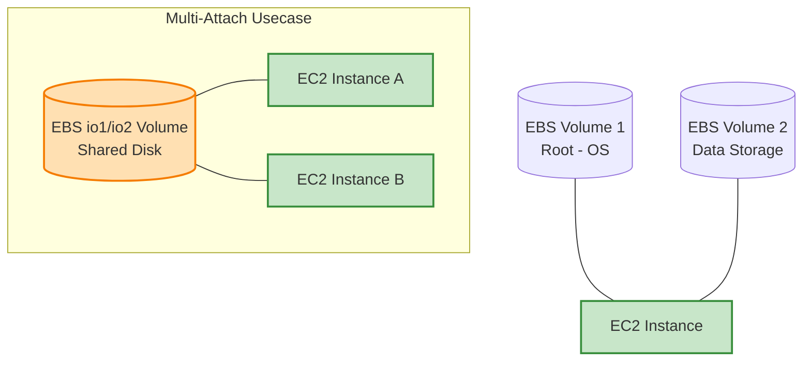

# Amazon Elastic Block Store (EBS)

**Amazon Elastic Block Store (EBS)** là dịch vụ cung cấp ổ lưu trữ dạng khối (Block Storage) hiệu năng cao và có độ tin cậy lớn, được thiết kế chuyên dụng để kết hợp và phục vụ cho máy chủ ảo Amazon EC2.

---

## I. Tổng quan về Amazon EBS

EBS hoạt động tương tự như một ổ đĩa cứng vật lý (SSD hoặc HDD) trong máy tính cá nhân nhưng được ảo hóa hoàn toàn và phân tách độc lập qua mạng mạng nội bộ của AWS.

### 1. Đặc điểm cốt lõi của EBS
*   **Đơn vị quản lý**: Hoạt động dưới dạng các **EBS Volume** độc lập có dung lượng xác định.
*   **Cơ chế truy xuất**: Bạn chỉ có thể đọc và ghi dữ liệu trên EBS Volume sau khi đã tiến hành **gắn (Attach)** nó vào một máy chủ EC2 cụ thể. EBS có thể làm ổ đĩa chạy hệ điều hành (Root Volume) hoặc ổ đĩa lưu trữ dữ liệu phụ (Data Volume).
*   **Tính co giãn linh hoạt (Elasticity)**:
    *   Bạn có thể nâng dung lượng (Size) ổ đĩa hoặc thay đổi loại ổ đĩa (Volume Type) cực kỳ dễ dàng trực tiếp **ngay khi máy chủ vẫn đang chạy** mà không cần khởi động lại.
    *    **LƯU Ý QUAN TRỌNG**: Hệ thống **chỉ cho phép tăng dung lượng, không cho phép giảm dung lượng**. Nếu muốn giảm kích thước ổ đĩa, bạn bắt buộc phải tạo một volume mới nhỏ hơn rồi di chuyển dữ liệu sang.
*   **Khả năng đa liên kết (Multi-Attach)**:
    *   Mặc định, một EBS Volume chỉ có thể gắn vào duy nhất một EC2 Instance tại một thời điểm.
    *   Tuy nhiên, một số dòng EBS cao cấp đặc biệt (như dòng Provisioned IOPS `io1` và `io2`) hỗ trợ tính năng **Multi-Attach**, cho phép gắn đồng thời một ổ đĩa vào **nhiều EC2 Instance** trong cùng một Availability Zone để chạy các ứng dụng dạng Cluster (đòi hỏi chia sẻ lưu trữ dùng chung).

---

## II. Các loại EBS Volume thông dụng (EBS Volume Types)

AWS chia các loại ổ lưu trữ EBS thành hai nhóm công nghệ chính: **SSD** (tối ưu tốc độ giao dịch, IOPS) và **HDD** (tối ưu băng thông truyền dữ liệu lớn, Throughput).

| Công nghệ | Loại đĩa (API Name) | Tên gọi | Ứng dụng phù hợp nhất |
| :--- | :--- | :--- | :--- |
| **SSD** | **gp2, gp3** | General Purpose SSD | Phù hợp cho hầu hết mọi tác vụ (Mặc định). |
| **SSD** | **io1, io2** | Provisioned IOPS SSD | Phù hợp cho cơ sở dữ liệu lớn đòi hỏi tốc độ siêu cao. |
| **HDD** | **st1** | Throughput Optimized HDD | Phù hợp cho BigData, Data Warehouse cần băng thông lớn. |
| **HDD** | **sc1** | Cold HDD | Lưu trữ giá rẻ cho dữ liệu ít khi truy cập (File Server). |
| **HDD** | **Magnetic (standard)** | Magnetic HDD | Dòng thế hệ cũ, hiệu năng thấp, hiện tại rất ít khi sử dụng. |

### 1. General Purpose SSD (gp2, gp3)
*   **Cân bằng hiệu năng và chi phí**: Là loại ổ đĩa mặc định của AWS, đáp ứng hoàn hảo cho đa số các nhu cầu thông thường.
*   *gp2*: Hiệu năng IOPS tự động co giãn dựa trên dung lượng ổ đĩa.
*   *gp3*: Thế hệ mới hơn, cho phép người dùng tùy ý tăng giảm IOPS và Throughput độc lập với dung lượng đĩa giúp tiết kiệm tới 20% chi phí so với gp2.
*   **Usecase**: Làm ổ đĩa root chứa hệ điều hành, môi trường phát triển ứng dụng, máy chủ Web thông thường.

### 2. Provisioned IOPS SSD (io1, io2)
*   **Hiệu năng đỉnh cao**: Được thiết kế cho các tác vụ đòi hỏi tốc độ đọc/ghi ngẫu nhiên (IOPS) cực kỳ lớn, độ trễ cực thấp và đảm bảo hiệu năng hoạt động ổn định 99.9% thời gian.
*   Hỗ trợ hoàn hảo tính năng **Multi-Attach**.
*   **Usecase**: Các cơ sở dữ liệu lớn có tần suất giao dịch cao (như MySQL, PostgreSQL, Oracle, NoSQL DB) hoặc các ứng dụng lõi tài chính.

### 3. Throughput Optimized HDD (st1)
*   **Tối ưu băng thông truyền tải**: Là loại ổ đĩa cứng cơ học HDD nhưng tập trung vào tốc độ truyền lượng lớn dữ liệu (Throughput) thay vì IOPS.
*   **Usecase**: Rất thích hợp làm kho lưu trữ cho các hệ thống xử lý dữ liệu lớn như **Apache Hadoop, Spark**, hệ thống Data Warehouse hoặc lưu trữ Log tập trung.

### 4. Cold HDD (sc1)
*   **Tối ưu hóa chi phí**: Ổ đĩa cơ học HDD có mức giá lưu trữ rẻ nhất của AWS cho các dữ liệu thô.
*   **Usecase**: Làm máy chủ lưu trữ file chia sẻ nội bộ (File Server), lưu trữ các file backup lịch sử dài hạn ít khi truy cập tới.

### 5. Magnetic (standard)
*   **Thế hệ di sản**: Là loại ổ đĩa thế hệ đầu tiên của AWS. Hiện nay đã lỗi thời, hiệu năng thấp và không còn được khuyến nghị cho các dự án mới.
