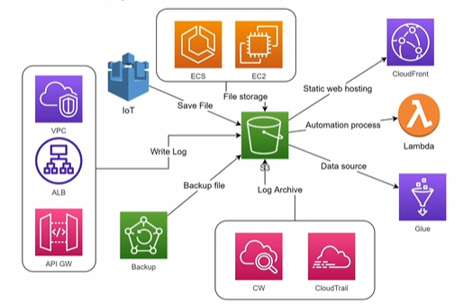

# Khả Năng Tích Hợp Của Amazon S3 (S3 Integration)

## I. Tổng quan về khả năng tích hợp của Amazon S3

Amazon S3 đóng vai trò là "trái tim" lưu trữ trong hệ sinh thái AWS. Nhờ khả năng lưu trữ không giới hạn, độ bền cao và tính bảo mật vượt trội, S3 là trung tâm kết nối của hầu hết các dịch vụ khác trên AWS để xây dựng các giải pháp từ đơn giản đến phức tạp như Web Hosting, CI/CD, Big Data, IoT và Automation.

---

## II. Sơ đồ kiến trúc tích hợp dịch vụ (S3 Integration Architecture)

Dưới đây là sơ đồ mô tả cách Amazon S3 tương tác và kết hợp với các dịch vụ AWS phổ biến:

---

## III. Chi tiết các mô hình kết hợp dịch vụ

### 1. Lưu trữ tệp tin cho ứng dụng (EC2, Container ECS/EKS, Lambda)
* **Mô tả**: S3 được sử dụng làm nơi lưu trữ các tệp tin media và tài liệu của ứng dụng chạy trên các dịch vụ tính toán (Compute Services).
* **Đặc điểm**:
  * Các ứng dụng có thể đọc và ghi các loại tệp tin đa dạng về định dạng (Image, Video, Audio, Document, Zip...) và kích thước (từ vài Bytes tới tối đa 5 TB).
  * Giúp giải phóng dung lượng ổ cứng (EBS) của máy chủ ảo EC2 hoặc Container, đảm bảo thiết kế ứng dụng không trạng thái (stateless), dễ dàng scale-out.

### 2. Nơi lưu trữ và lưu trữ lâu dài nhật ký hệ thống (Log Archive - VPC, ALB, API Gateway, CloudTrail...)
* **Mô tả**: S3 hoạt động như một kho lưu trữ tập trung (Centralized Log Bucket) cho hầu hết các dịch vụ AWS khác.
* **Đặc điểm**:
  * **VPC Flow Logs**: Lưu lại lưu lượng mạng chạy qua VPC.
  * **ALB Access Logs**: Lưu nhật ký truy cập ứng dụng đi qua Application Load Balancer.
  * **API Gateway Logs**: Lưu log của các API calls.
  * **AWS CloudTrail & CloudWatch**: Tự động export log hoạt động tài khoản và log hệ thống sang S3 để lưu trữ lâu dài (archiving) với chi phí thấp bằng S3 Glacier.

### 3. Nguồn dữ liệu cho các bài toán phân tích dữ liệu lớn (Big Data & Data Warehouse)
* **Mô tả**: S3 đóng vai trò là tầng lưu trữ (Storage Layer) cho mô hình **Data Lake** trên AWS.
* **Đặc điểm**:
  * Dữ liệu thô (raw data) lưu trên S3 có thể được kết nối làm nguồn dữ liệu (Data Source) cho **AWS Glue** để quét cấu trúc (Crawler) và định nghĩa bảng.
  * Cho phép **Amazon Athena** truy vấn trực tiếp dữ liệu dạng CSV, JSON, Parquet trên S3 bằng câu lệnh SQL thông thường.
  * Đồng bộ hoặc nạp dữ liệu trực tiếp vào Data Warehouse **Amazon Redshift** phục vụ báo cáo doanh nghiệp.

### 4. Nơi lưu trữ dữ liệu từ các thiết bị IoT (Internet of Things)
* **Mô tả**: Dữ liệu gửi lên liên tục từ hàng triệu thiết bị IoT thông qua AWS IoT Core có thể được định tuyến để lưu trữ trực tiếp vào S3.
* **Đặc điểm**: Phục vụ việc lưu trữ lịch sử hoạt động của thiết bị để phân tích sau này (như nhiệt độ, độ ẩm, trạng thái máy móc).

### 5. Vùng lưu trữ tạm thời cho bài toán ETL (Extract - Transform - Load)
* **Mô tả**: S3 đóng vai trò là vùng đệm (Staging Area) lưu trữ tạm thời trong luồng xử lý ETL.
* **Đặc điểm**: Khi dữ liệu thô được upload lên S3, một sự kiện `ObjectCreated` được kích hoạt để gọi **AWS Lambda** thực hiện việc biến đổi dữ liệu (Transform) và lưu kết quả đã xử lý sang một bucket S3 khác hoặc nạp vào Database.

### 6. Phân phối Website tĩnh (S3 + CloudFront)
* **Mô tả**: Kết hợp tính năng hosting website tĩnh của S3 với dịch vụ mạng phân phối nội dung (CDN) Amazon CloudFront.
* **Đặc điểm**:
  * S3 lưu trữ các tệp tĩnh (HTML, CSS, JS, hình ảnh).
  * CloudFront đứng trước S3 để cache nội dung tại các Edge Location toàn cầu giúp giảm tối đa độ trễ tải trang và hỗ trợ cấu hình HTTPS/SSL miễn phí thông qua ACM.

---

## IV. Lưu ý quan trọng

* > [!NOTE]
  * > Đây là các dịch vụ nổi bật thường được sử dụng kết hợp với S3 phổ biến nhất. Trên thực tế, hầu như bất kỳ dịch vụ nào trên AWS cần lưu trữ dữ liệu bền vững, backup định kỳ hoặc lưu log đều hỗ trợ tích hợp sẵn với Amazon S3.
