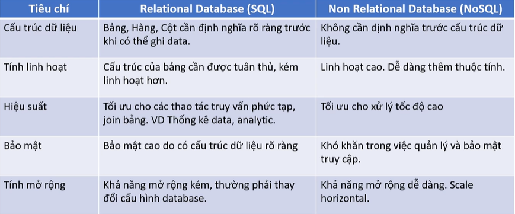
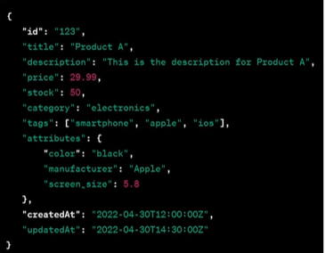

# 1. Amazon DynamoDB Overview (Tổng quan về Amazon DynamoDB)


## I. NoSQL là gì?

> **Non-Relational Database**, còn được gọi là **NoSQL (Not Only SQL)** là một hệ thống cơ sở dữ liệu mà không sử dụng mô hình quan hệ truyền thống dưới dạng các bảng và các quan hệ khóa ngoại. Thay vào đó, nó sử dụng một cấu trúc dữ liệu khác, phù hợp hơn với các ứng dụng có khối lượng dữ liệu lớn, tốc độ truy vấn nhanh và tính mở rộng cao hơn.

### Tại sao cần NoSQL?

Cơ sở dữ liệu quan hệ (SQL) truyền thống (như MySQL, PostgreSQL, SQL Server) hoạt động rất tốt cho các dữ liệu có cấu trúc định sẵn và các giao dịch phức tạp cần tính ACID nghiêm ngặt. Tuy nhiên, khi đối mặt với kỷ nguyên dữ liệu lớn (Big Data) và các ứng dụng thời gian thực (Real-time apps) phục vụ hàng triệu người dùng đồng thời, SQL bộc lộ một số hạn chế:
* **Khó mở rộng theo chiều ngang (Horizontal Scaling)**: SQL được thiết kế để chạy tốt nhất trên một máy chủ đơn lẻ (Scale Vertical - nâng cấp RAM, CPU). Việc phân tán một cơ sở dữ liệu quan hệ ra nhiều máy chủ (Sharding/Clustering) là cực kỳ phức tạp và tốn kém.
* **Schema cứng nhắc**: Mỗi khi muốn thêm một trường thông tin mới vào bảng, bạn phải thực hiện lệnh `ALTER TABLE`, điều này có thể gây treo hệ thống hoặc làm chậm ứng dụng nếu bảng có hàng triệu dòng dữ liệu.
* **Tốc độ truy vấn giảm khi JOIN nhiều bảng**: Khi dữ liệu lớn lên, các câu lệnh `JOIN` phức tạp giữa nhiều bảng sẽ làm giảm đáng kể hiệu năng hệ thống.

NoSQL ra đời để giải quyết các bài toán trên bằng cách **bỏ qua tính chuẩn hóa dữ liệu (normalization)**, tập trung vào **hiệu năng**, **khả năng co giãn không giới hạn** và **sự linh hoạt của schema**.

---

## II. Các loại cơ sở dữ liệu NoSQL phổ biến

NoSQL không phải là một loại cơ sở dữ liệu duy nhất mà được chia làm 4 nhóm chính dựa trên cách lưu trữ dữ liệu:

### 1. Key-Value Store (Kho lưu trữ Khóa - Giá trị)
* **Định nghĩa**: Lưu trữ dữ liệu dưới dạng các cặp key-value (khóa-giá trị). Các khóa được sử dụng để truy cập và lấy dữ liệu, trong khi giá trị có thể là bất kỳ kiểu dữ liệu nào.
* **Đại diện**: **Amazon DynamoDB**, Redis, Memcached.
* **Trường hợp sử dụng**: Lưu Session ID, giỏ hàng (Shopping Cart), Cache dữ liệu.

### 2. Document Store (Kho lưu trữ Tài liệu)
* **Định nghĩa**: Lưu trữ dữ liệu dưới dạng tài liệu, thường là định dạng JSON hoặc XML. Các tài liệu được lưu trữ theo dạng phi cấu trúc, cho phép dữ liệu được lưu trữ một cách linh hoạt và thêm vào dễ dàng.
* **Đại diện**: **Amazon DocumentDB**, MongoDB, CouchDB.
* **Trường hợp sử dụng**: Hồ sơ người dùng (User Profile), Hệ thống quản trị nội dung (CMS), Catalogue sản phẩm.

### 3. Column Oriented Store (Kho lưu trữ hướng Cột)
* **Định nghĩa**: Lưu trữ dữ liệu dưới dạng các bảng với hàng và cột, nhưng khác với cơ sở dữ liệu quan hệ, các cột có thể được thêm và loại bỏ một cách độc lập.
* **Đại diện**: **Amazon Keyspaces** (Cassandra), Apache HBase, Google Bigtable.
* **Trường hợp sử dụng**: Phân tích dữ liệu lớn (Big Data Analytics), Hệ thống ghi Log tập trung, Dữ liệu thiết bị IoT (Time-series data).

### 4. Graph Database (Cơ sở dữ liệu Đồ thị)
* **Định nghĩa**: Lưu trữ dữ liệu dưới dạng các nút (nodes) và mối quan hệ giữa chúng, cung cấp khả năng xử lý dữ liệu phức tạp.
* **Đại diện**: **Amazon Neptune**, Neo4j.
* **Trường hợp sử dụng**: Mạng xã hội (Social Networks), Hệ thống gợi ý (Recommendation Engine), Phát hiện gian lận tài chính (Fraud Detection).

---

## III. Bảng so sánh chi tiết: SQL vs NoSQL




---

## IV. Amazon DynamoDB là gì?

> **Amazon DynamoDB** là một cơ sở dữ liệu key-value NoSQL, fully managed và serverless, được thiết kế để vận hành các ứng dụng high-performance ở mọi quy mô. DynamoDB cung cấp built-in security, continuous backups, automated multi-Region replication, in-memory caching, cùng các công cụ data import và export.


DynamoDB hỗ trợ cả hai mô hình dữ liệu là **Key-Value Store** và **Document Store** (JSON).

### Các đặc trưng của DynamoDB:

* **Serverless**: Hạ tầng hoàn toàn được quản lý bởi AWS. User tương tác với DynamoDB thông qua Console, CLI, các tool client hoặc Software SDK.
* **Tổ chức dữ liệu dạng Table**: Dữ liệu được tổ chức thành các đơn vị table.
* **Độ trễ thấp**: Đảm bảo độ trễ cực thấp ở mức **single digit millisecond** (dưới 10ms).
* **SLA cực cao**: Đảm bảo độ tin cậy với **99.999% availability**.
* **Automatic Scale Up/Down**: Tự động co giãn tùy theo workload dựa trên cấu hình WCU (Write Capacity Units) và RCU (Read Capacity Units).
* **Khả năng kết hợp rộng rãi**: Kết hợp được với nhiều service khác của AWS (như S3, Glue Elastic Views, Kinesis Data Streams, CloudTrail, CloudWatch...).

### Ưu điểm & Nhược điểm của DynamoDB:

#### 1. Ưu điểm:
* **Serverless**: Chi phí vận hành thấp, tính khả dụng cao.
* **Linh hoạt trong cấu hình**: Zero idle cost (không phát sinh chi phí khi không có truy cập), cực kỳ phù hợp cho startup.
* **Khả năng scale không giới hạn**: Khả năng mở rộng không giới hạn (về mặt lý thuyết), độ trễ thấp và hiệu suất cao.
* **Strongly consistency**: Hỗ trợ tính nhất quán mạnh mẽ (Strongly Consistent Reads).
* **Hỗ trợ mã hoá**: Bảo mật dữ liệu với tính năng mã hóa mặc định.

#### 2. Nhược điểm:
* **Hạn chế phân tích**: Không phù hợp với các tác vụ data query và analytic phức tạp (OLAP).
* **Thiếu tính năng so với SQL**: Thiếu nhiều tính năng đặc trưng khi so sánh với SQL (relational database).

## V. Các trường hợp sử dụng phổ biến (Use Cases)

* **Software application**: Hầu hết các software có nhu cầu về high concurrent cho hàng triệu user đều có thể cân nhắc sử dụng DynamoDB. Ví dụ: E-commerce.
* **Media metadata store**: Lưu trữ metadata cho các media.
* **Gaming platform**: Hệ thống game lưu trữ thông tin người chơi, bảng xếp hạng.
* **Social media**: Mạng xã hội, bài đăng, bình luận.
* **Logistic system**: Hệ thống log, vận chuyển, trạng thái giao nhận hàng.
* **Ứng dụng IoT**: Thu thập và lưu trữ dữ liệu thời gian thực từ các thiết bị thông minh.

---

## VI. Các khái niệm cơ bản (DynamoDB Concepts)

Để chuẩn bị cho việc thiết kế bảng, bạn cần nắm rõ các khái niệm cốt lõi sau:
* **Table**: Đơn vị quản lý cao nhất của DynamoDB. Table không thể trùng tên trên một region.
* **Primary key**: Thông tin bắt buộc khi tạo table, Primary key chia làm 2 loại:
  * **Simple Primary key**: Chỉ bao gồm Partition key.
  * **Composite primary key**: Bao gồm Partition key và Sort key.
* **Global Secondary index (Optional)**: Bao gồm một cặp partition key & sort key tuỳ ý.
* **Local Secondary index (Optional)**: Bao gồm một cặp partition key giống với partition key của table và sort key tuỳ ý.
* **Item (Bản ghi)**: Tương tự như một dòng trong SQL, là đơn vị dữ liệu đơn lẻ trong table (kích thước tối đa 400 KB).
* **Attribute (Thuộc tính)**: Tương tự như một cột trong SQL, gồm cặp tên (name) và giá trị (value).

### Kiểu dữ liệu hỗ trợ (Data type)

DynamoDB hỗ trợ các loại data type sau:
* **String**
* **Number**
* **Binary**
* **Boolean**
* **Null**
* **Set**
* **Map**
* **List**

#### Ví dụ minh họa một Item trong DynamoDB:



```json
{
  "id": "123",
  "title": "Product A",
  "description": "This is the description for Product A",
  "price": 29.99,
  "stock": 50,
  "category": "electronics",
  "tags": ["smartphone", "apple", "ios"],
  "attributes": {
    "color": "black",
    "manufacturer": "Apple",
    "screen_size": 5.8
  },
  "createdAt": "2022-04-30T12:00:00Z",
  "updatedAt": "2022-04-30T14:30:00Z"
}
```

---

* **Bài tiếp theo**: [2. Amazon DynamoDB Data Model (Mô hình dữ liệu của DynamoDB)](2.%20Amazon%20DynamoDB%20Data%20Model.md)
