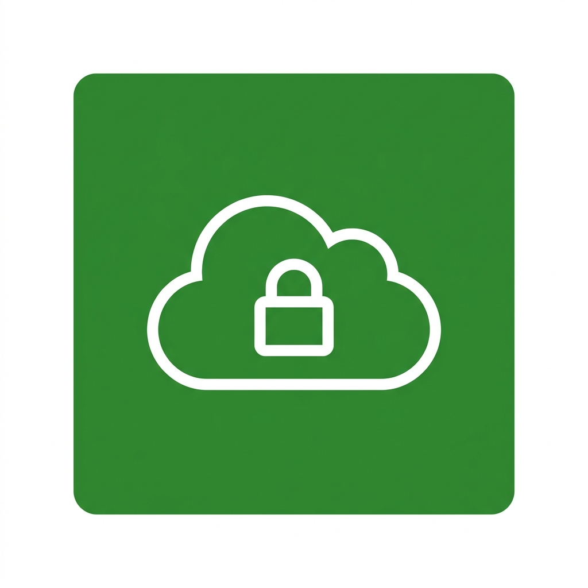

# 1. VPC Overview (Tổng quan về Virtual Private Cloud)

## I. VPC Overview (Tổng quan về VPC)

**Virtual Private Cloud (VPC)** là viết tắt của dịch vụ mạng riêng ảo được cung cấp bởi AWS. Dịch vụ này cho phép người dùng tạo một mạng ảo cô lập (virtual network) trên đám mây và toàn quyền kiểm soát cấu hình mạng cũng như luồng dữ liệu in/out (traffic) của mạng đó.

VPC tương đối giống với hạ tầng mạng ở các trung tâm dữ liệu (datacenter) truyền thống, tuy nhiên các khái niệm và thao tác quản trị đã được AWS đơn giản hóa và trừu tượng hóa, giúp người dùng dễ tiếp cận và vận hành hơn rất nhiều.

*   **Bản chất:** VPC là nền tảng cốt lõi của bảo mật mạng trên AWS. Bất kể bạn triển khai máy chủ ảo (EC2), cơ sở dữ liệu (RDS) hay cụm Kubernetes (EKS), tất cả đều cần được đặt và chạy trong các subnet của một VPC cụ thể.
*   **Mục đích:** Tách biệt tài nguyên của bạn với tài nguyên của các khách hàng khác trên AWS, tạo lập ranh giới bảo mật vững chắc cho ứng dụng.

---

## II. Các thành phần cơ bản trong VPC

Để làm chủ VPC, bạn cần nắm vững các khối thành phần (building blocks) cấu thành nên nó:

1.  **CIDR Block (Classless Inter-Domain Routing):**
    *   Dải địa chỉ IP được gán cho VPC (ví dụ: `10.0.0.0/16` cung cấp tối đa 65,536 địa chỉ IP).
2.  **Subnet (Mạng con):**
    *   Chia nhỏ dải IP của VPC thành các phân vùng mạng nhỏ hơn. Có hai loại subnet chính:
        *   **Public Subnet:** Mạng con có thể giao tiếp trực tiếp với Internet công cộng.
        *   **Private Subnet:** Mạng con bị cô lập hoàn toàn, không thể truy cập trực tiếp từ Internet, thường dùng cho Database (RDS), Application Servers.
3.  **Route Table (Bảng định tuyến):**
    *   Tập hợp các quy tắc (routes) xác định luồng đi của traffic từ subnet/gateway đến các đích mong muốn.
4.  **Internet Gateway (IGW):**
    *   Cổng kết nối cho phép tài nguyên trong public subnet giao tiếp ra ngoài Internet công cộng và ngược lại.
5.  **NAT Gateway (Network Address Translation):**
    *   Cho phép các tài nguyên nằm trong private subnet kết nối ra ngoài Internet (ví dụ: để cập nhật phần mềm, tải thư viện) nhưng ngăn chặn Internet kết nối ngược lại vào chúng. NAT Gateway phải được đặt ở public subnet.
6.  **Security Group (Tường lửa ở cấp độ Instance):**
    *   Bộ lọc traffic (Stateful firewall) áp dụng trực tiếp cho các EC2 instance hoặc RDS instance.
7.  **Network ACL - NACL (Tường lửa ở cấp độ Subnet):**
    *   Bộ lọc traffic (Stateless firewall) áp dụng ở cấp độ subnet, kiểm soát dữ liệu đi vào và đi ra khỏi toàn bộ subnet đó.

---

## III. Hướng dẫn cơ bản để bắt đầu

Quy trình thiết lập một VPC tiêu chuẩn cho môi trường Web/Application:

1.  **Khởi tạo VPC:** Định nghĩa dải CIDR block (ví dụ: `10.0.0.0/16`).
2.  **Tạo các Subnets:**
    *   Public Subnet (ví dụ: `10.0.1.0/24`) đặt tại các Availability Zone khác nhau để đảm bảo tính sẵn sàng cao (HA).
    *   Private Subnet (ví dụ: `10.0.10.0/24`) cho các ứng dụng nội bộ hoặc cơ sở dữ liệu.
3.  **Cấu hình Routing:**
    *   Gắn Internet Gateway (IGW) vào VPC.
    *   Tạo **Public Route Table** có route `0.0.0.0/0` trỏ tới IGW, sau đó liên kết bảng này với Public Subnet.
    *   Tạo NAT Gateway trong Public Subnet.
    *   Tạo **Private Route Table** có route `0.0.0.0/0` trỏ tới NAT Gateway, sau đó liên kết bảng này với Private Subnet.
4.  **Kiểm soát bảo mật:** Thiết lập Security Group cho EC2/RDS và cấu hình NACL cho các subnet.

---

*   **Bài trước:** [11. AWS Lambda Hands-on Lab(Read CSV and Save to DynamoDB) (Lab đọc CSV lưu vào DynamoDB)](../7.%20AWS%20Lambda/11.%20AWS%20Lambda%20Hands-on%20Lab%28Read%20CSV%20and%20Save%20to%20DynamoDB%29.md)
*   **Bài tiếp theo:** [2. Các thành phần cơ bản của VPC (Amazon VPC Basic Components)](2.%20VPC%20Basic%20Components.md)
