# 2. Các thành phần cơ bản của VPC (Amazon VPC Basic Components)

Để xây dựng và quản trị một hệ thống mạng trên AWS, việc hiểu rõ các thành phần cơ bản trong VPC là vô cùng quan trọng. Dưới đây là các thành phần cốt lõi cấu thành nên mạng ảo của bạn:

---

## I. Chi tiết các thành phần cốt lõi

### 1. VPC (Virtual Private Cloud)
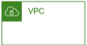 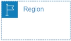

*   **Định nghĩa:** Một mạng ảo được tạo ra ở cấp độ **Region**.
*   **Bản chất:** VPC thiết lập một môi trường mạng cô lập logic trên AWS Cloud dành riêng cho tài khoản của bạn. Bạn hoàn toàn có quyền kiểm soát dải IP, phân chia subnet, cấu hình route table và network gateway.

### 2. Subnet (Mạng con)
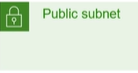 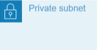 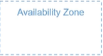

*   **Định nghĩa:** Một dải IP được định nghĩa nằm trong VPC. Mỗi subnet phải được quyết định **Availability Zone (AZ)** tại thời điểm tạo ra.
*   **Phân loại:**
    *   **Public Subnet:** Có đường truyền trực tiếp ra internet thông qua Internet Gateway.
    *   **Private Subnet:** Không có đường truyền trực tiếp từ internet vào, bảo mật cao hơn, thích hợp cho database hoặc backend services.

### 3. IP Address (Địa chỉ IP)
*   **Định nghĩa:** IP v4 hoặc v6 được cấp phát để định danh các tài nguyên trong mạng.
*   **Phân loại:**
    *   **Private IP:** Sử dụng cho việc giao tiếp nội bộ giữa các tài nguyên trong cùng một VPC (hoặc qua VPC Peering/VPN).
    *   **Public IP:** Sử dụng để kết nối và giao tiếp với Internet bên ngoài.

### 4. Routing (Định tuyến)

*   **Định nghĩa:** Xác định traffic sẽ được điều hướng đi đâu trong mạng.
*   **Công cụ:** **Route Table** chứa một tập hợp các quy tắc định tuyến (routes) định hướng lưu lượng truy cập từ subnet hoặc gateway đến các tài nguyên hoặc internet.

### 5. Elastic IP (EIP)

*   **Định nghĩa:** Địa chỉ IP tĩnh (Public IPv4) được cấp phát riêng cho tài khoản AWS của bạn, có thể truy cập từ Internet.
*   **Đặc điểm nổi bật:**
    *   EIP có thể được gắn (associate) hoặc gỡ bỏ (disassociate) linh hoạt giữa các EC2 Instance khác nhau.
    *   Không bị thu hồi khi instance xảy ra hành động **Start -> Stop** (khác với Public IP thông thường sẽ bị thay đổi khi restart máy chủ).
    *   *Lưu ý:* AWS sẽ tính phí nếu EIP được cấp phát nhưng không gắn vào instance nào đang chạy (để tránh lãng phí tài nguyên IP công cộng).

### 6. Security Group

*   **Định nghĩa:** Đóng vai trò như một firewall ở cấp độ instance, định nghĩa traffic được đi vào / đi ra.
*   **Lưu ý:** *Đã học chi tiết ở bài EC2.

### 7. Network Access Control List (ACL)

*   **Định nghĩa:** Được apply ở cấp độ subnet, tương tự như security group nhưng hỗ trợ cả rule **Allow** và **Deny**, đồng thời các rule được đánh độ ưu tiên (rule number) để xử lý theo thứ tự từ thấp đến cao.
*   **Đặc điểm:** Mặc định khi tạo VPC sẽ có 1 ACL được apply cho toàn bộ subnet trong VPC (mở all traffic không chặn gì cả).

### 8. VPC Flow Logs
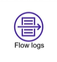

*   **Định nghĩa:** Capture các thông tin di chuyển của traffic trong network.

### 9. VPN Connection
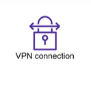

*   **Định nghĩa:** kết nối VPC trên AWS với hệ thống dưới On-premise.  

### 10. Elastic Network Interface (ENI)
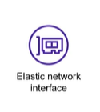

*   **Định nghĩa:** đóng vai trò như 1 card mạng ảo.

### 11. Internet Gateway
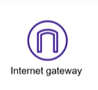

*   **Định nghĩa:** Kết nối VPC với Internet, là cổng vào từ internet tới các thành phần trong VPC.

### 12. NAT Gateway
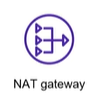

*   **Định nghĩa:** dịch vụ NAT của AWS cho phép các thành phần bên trong kết nối tới internet nhưng không cho bên ngoài kết nối tới.  

### 13. VPC Endpoint

*   **Định nghĩa:** kênh kết nối private giúp kết nối tới các services khác của AWS mà không thông qua internet.

### 14. Peering Connection
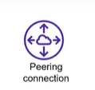

*   **Định nghĩa:** kênh kết nối giữa 2 VPC.

### 15. Transit Gateways
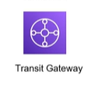

*   **Định nghĩa:** đóng vai trò như 1 hub đứng giữa các VPCs, VPN Connection, Direct Connect.

---

*   **Bài trước:** [1. VPC Overview (Tổng quan về Virtual Private Cloud)](1.%20VPC%20Overview.md)
*   **Bài tiếp theo:** [3. Thiết kế VPC phổ biến (Common VPC Design)](3.%20Common%20VPC%20Design.md)
