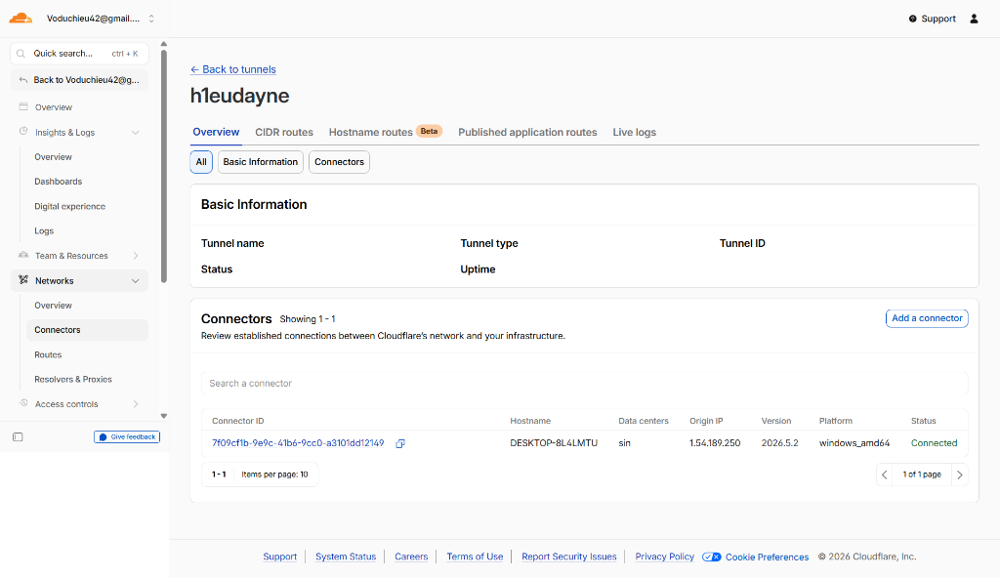
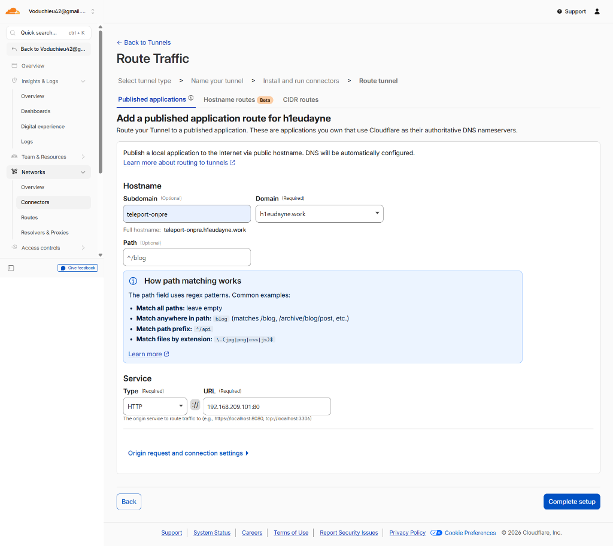

# Bài 5: Triển khai công cụ quản lý truy cập máy chủ (Teleport)

Tài liệu này hướng dẫn cách triển khai công cụ quản lý truy cập máy chủ tập trung (Teleport) trên môi trường On-Premise, bao gồm các bước cấu hình Load Balancer, trỏ DNS và cài đặt Nginx.

---

### I. Đánh giá phương án cài đặt Teleport trên On-Premise

Khi quyết định cài đặt công cụ quản lý truy cập (ví dụ: Teleport) trực tiếp trên hạ tầng On-Premise, cần cân nhắc kỹ các ưu điểm và nhược điểm sau:

*   **Ưu điểm:**
    *   Tận dụng trực tiếp hạ tầng nội bộ của doanh nghiệp, giúp tăng tính bảo mật và kiểm soát dữ liệu.
    *   Tạo tính đồng nhất trong việc quản trị và giám sát các luồng truy cập ra/vào hệ thống.
*   **Nhược điểm:**
    *   Nếu hệ thống On-Premise gặp lỗi hàng loạt (ví dụ: mất điện, mất mạng diện rộng, lỗi phần cứng), server Teleport cũng sẽ bị sập theo.
    *   Khi hạ tầng phân bố ở nhiều nơi (bao gồm cả Cloud hay các cụm Kubernetes cluster bên ngoài), việc mất kết nối tới Teleport On-Premise sẽ làm mất quyền kiểm soát toàn bộ hệ thống phân tán.

---

### II. Các bước triển khai ban đầu

#### 1. Chuẩn bị mô hình
Thiết lập bao gồm máy chủ Load Balancer (chạy Nginx) đóng vai trò làm Gateway tiếp nhận yêu cầu, phân phối lưu lượng và chuyển hướng truy cập tới các node Teleport phía sau.

#### 2. Trỏ tên miền (Domain) về IP Public
Để truy cập dịch vụ từ ngoài Internet qua giao diện Web hoặc Terminal Client, chúng ta cần liên kết một tên miền hoặc phụ miền (sub-domain) với địa chỉ IP Public của máy chủ.

1.  **Kiểm tra IP Public hiện tại của server:**
    Chạy lệnh sau trên terminal của server Teleport:
    ```bash
    curl -4 ifconfig.me
    ```
    *(Kết quả hiển thị địa chỉ IP Public dạng IPv4 của đường truyền mạng)*
    
    

2.  **Cấu hình DNS Record (Ví dụ trên Cloudflare):**
    *   Truy cập bảng quản trị DNS của nhà đăng ký tên miền.
    *   Thêm một bản ghi mới (**Add Record**).
    *   Điền các thông tin:
        *   **Type (Loại bản ghi):** `A`
        *   **Name (Tên miền phụ):** `teleport-onpre` (hoặc tên miền mong muốn, tạo thành FQDN `teleport-onpre.h1eudayne.work`).
        *   **IPv4 address (Địa chỉ IP):** Nhập IP Public vừa lấy được ở bước trên.
        *   **Proxy status:** Bật/Tắt đám mây Cloudflare Proxy (tùy thuộc nhu cầu ẩn IP gốc và sử dụng SSL/TLS của Cloudflare).
    *   Nhấn **Save** để lưu bản ghi.

    

#### 3. Setup Nginx Load Balancer
Cài đặt Nginx làm Proxy ngược (Reverse Proxy) / Load Balancer để tiếp nhận và phân phối các kết nối HTTP/HTTPS cũng như SSH tunnel của Teleport.

1.  **Cài đặt Nginx trên Ubuntu/Debian:**
    Cập nhật danh sách gói và cài đặt gói `nginx`:
    ```bash
    sudo apt update
    sudo apt install nginx -y
    ```
    
2.  **Kiểm tra trạng thái hoạt động:**
    Truy cập trực tiếp địa chỉ IP Private của máy chủ Load Balancer qua trình duyệt web (`http://<IP_load_balancer>`). Nếu hiển thị trang chào mừng mặc định của Nginx thì việc cài đặt ban đầu đã thành công.

    

#### 4. Setup Port Forwarding (Kết nối từ ngoài Internet)

Để có thể kết nối từ Internet vào máy chủ Load Balancer trong mạng nội bộ, thông thường có 2 phương pháp chính:

*   **Cách 1: Mở port trên Modem/Router (Traditional Port Forwarding)**
    *   *Nguyên lý:* Cấu hình NAT/Port Forwarding trên Modem nhà mạng để ánh xạ IP Public và port của modem tới IP Private của Nginx Load Balancer.
    *   *Nhược điểm:* Yêu cầu quyền quản trị Modem wifi, cần thuê IP Public tĩnh hoặc dùng DDNS, và việc mở cổng trực tiếp ra Internet tiềm ẩn nhiều nguy cơ bảo mật nếu không cấu hình firewall chặt chẽ.
*   **Cách 2: Sử dụng Cloudflare Tunnel (Khuyên dùng)**
    *   *Nguyên lý:* Chạy một phần mềm Agent/Connector (`cloudflared`) trên server nội bộ để chủ động thiết lập kết nối outbound (gọi ra) tới Cloudflare Zero Trust.
    *   *Ưu điểm:* Không cần mở bất kỳ port inbound nào trên modem wifi, không cần cấu hình NAT, toàn bộ lưu lượng được mã hóa an toàn qua proxy của Cloudflare.

Dưới đây là hướng dẫn chi tiết thực hiện theo **Cách 2 (Cloudflare Tunnel)**:

1.  **Truy cập Cloudflare Zero Trust:**
    *   Đăng nhập vào Cloudflare Dashboard.
    *   Di chuyển tới menu **Protect & Connect** -> **Zero Trust**.
    *   Nếu chưa thiết lập gói cước Zero Trust, nhấn **Get started** và làm theo hướng dẫn để chọn gói dịch vụ (chọn gói Free).

    

2.  **Khởi tạo Tunnel:**
    *   Trong menu bên trái của Zero Trust Dashboard, chọn **Networks** -> **Tunnels** (hoặc chọn **Networks** -> **Overview** -> **Manage Tunnels**).
    *   Nhấn chọn **Create a tunnel** (hoặc **Add a Tunnel**).

    

3.  **Đặt tên cho Tunnel:**
    *   Nhập tên gợi nhớ đại diện cho hạ tầng của bạn (ví dụ: `h1eudayne`).
    *   Nhấn **Save tunnel**.

    

4.  **Cài đặt và chạy Cloudflare Connector (cloudflared):**
    *   Tại tab **Install and run connectors**, chọn hệ điều hành tương ứng với máy chủ chạy Nginx Load Balancer (Ví dụ: `Windows`, `Debian`, hoặc `Ubuntu` tùy môi trường).
    *   Hệ thống sẽ cung cấp lệnh tải và cài đặt kèm token xác thực duy nhất.
    *   Sao chép lệnh cài đặt và chạy trên máy chủ dưới quyền Administrator/Root.
    *   > [!TIP]
    *   > **Lưu ý xử lý lỗi:** Nếu hệ thống báo lỗi không nhận dạng lệnh `cloudflared`, hãy chỉ định rõ đường dẫn tuyệt đối đến tệp thực thi `cloudflared.exe` (ví dụ: `C:\path\to\cloudflared.exe service install ...` trên Windows).
    *   Sau khi chạy thành công, trạng thái kết nối ở phần **Connectors** phía dưới sẽ báo xanh (Active/Connected).

    
    
    *   Chúng ta cũng có thể kiểm tra trạng thái hoạt động trực tiếp trong danh sách Connector của Tunnel:
    
    

5.  **Cấu hình định tuyến lưu lượng (Route Traffic):**
    *   > [!IMPORTANT]
    *   > **Lưu ý quan trọng:** Trước khi định tuyến, **phải xóa bản ghi DNS A** của tên miền phụ `teleport-onpre` đã tạo thủ công ở **Bước 2** trước đó. Vì ở bước này Cloudflare sẽ tự động tạo bản ghi DNS CNAME để trỏ domain phụ về tunnel.
    *   Tại tab **Route tunnel** (Setup Traffic), cấu hình như sau:
        *   **Subdomain:** `teleport-onpre` (tên miền phụ muốn cấu hình).
        *   **Domain:** Chọn domain của bạn (ví dụ: `h1eudayne.work`).
        *   **Path:** Để trống (leave empty) để áp dụng cho mọi đường dẫn truy cập.
        *   **Service:**
            *   **Type:** `HTTP`
            *   **URL:** `192.168.209.101:80` (địa chỉ IP nội bộ kèm cổng của Nginx Load Balancer).
    *   Nhấn **Complete setup** để hoàn tất quá trình định tuyến.

    


